# CipherOdyssey — Complete Application Documentation

> A gamified classical cryptography laboratory.
> **Learn → Practice → Decode → Score → Progress**

---

## Table of Contents

1. [Tech Stack](#1-tech-stack)
2. [React In Depth](#2-react-in-depth)
3. [Database Connection](#3-database-connection)
4. [Backend](#4-backend)
5. [API, Node & Express](#5-api-node--express)
6. [Full Architecture](#6-full-architecture)
7. [Workflow](#7-workflow)
8. [File Structure](#8-file-structure)
9. [Detailed File-by-File Explanation](#9-detailed-file-by-file-explanation)
10. [Flowcharts](#10-flowcharts)
11. [Terminal Commands — Start & Stop](#11-terminal-commands--start--stop)
12. [File-to-File Calling Architecture](#12-file-to-file-calling-architecture)

---

# 1. Tech Stack

CipherOdyssey is a full-stack JavaScript application. Every layer — frontend, backend, shared logic, and database — uses the same language (JavaScript / ES Modules), enabling code sharing between client and server.

## Frontend Stack

| Technology | Version | Role |
|:---|:---|:---|
| **React** | 19 | UI component library — renders all views, manages component lifecycle |
| **Vite** | 6 | Build tool & dev server — provides instant Hot Module Replacement (HMR) |
| **Tailwind CSS** | v4 | Utility-first CSS framework — all styling via class names, no separate CSS files |
| **Framer Motion** | 12 | Animation library — drag interactions, layout transitions, spring physics |
| **Zustand** | 5 | State management — lightweight stores replacing Redux/Context complexity, with localStorage persistence |
| **Lucide React** | Latest | Icon library — provides clean SVG icons (Heart, Trophy, Star, RotateCcw, etc.) |

## Backend Stack

| Technology | Version | Role |
|:---|:---|:---|
| **Node.js** | 24 | JavaScript runtime — executes server-side code outside the browser |
| **Express** | 4 | Web framework — handles HTTP requests, routing, middleware |
| **Mongoose** | 8 | ODM (Object Document Mapper) — defines schemas and interacts with MongoDB |
| **MongoDB** | 8 | NoSQL database — stores ciphers, challenges, and user scores as documents |
| **cors** | 2.8 | Middleware — allows the frontend (port 5173) to talk to the backend (port 5000) |
| **dotenv** | 16 | Config — loads environment variables from `.env` files |
| **nanoid** | 5 | ID generator — creates unique identifiers |
| **express-rate-limit** | 7.5 | Security — prevents abuse by limiting requests per minute |

## Shared Layer

| Technology | Role |
|:---|:---|
| **`shared/cipherEngine.js`** | Single canonical file containing all 10 cipher algorithms. Both frontend and backend import from this exact same file, guaranteeing identical encoding and decoding. |
| **`shared/wordBank.js`** | Canonical 162-phrase tactical word bank (66 short, 60 medium, 36 tactical phrases) organized by difficulty pools for challenges. |

## Testing

| Technology | Role |
|:---|:---|
| **Node.js Test Runner** (`node:test`) | Built-in test framework — no Jest or Mocha needed. Runs 35 tests total (19 frontend + 16 backend). |

---

# 2. React In Depth

## What is React?

React is a JavaScript library for building user interfaces. Instead of manipulating the browser's DOM directly, you describe what the UI should look like using **components** (functions that return JSX), and React efficiently updates the actual DOM to match.

## How CipherOdyssey Uses React

### Entry Point Flow

```
index.html
  └── <div id="root"></div>     ← React mounts here
        └── src/main.jsx        ← Creates the React root
              └── <App />        ← Root component (Single-page scrolling layout)
```

[main.jsx](file:///home/sjh/cipher/src/main.jsx) calls `ReactDOM.createRoot()` to take over the `#root` div, then directly renders `<App />` inside `<React.StrictMode>`.

### Component Hierarchy

```
<App>
├── <Navbar activeSection={activeSection} onNavigate={scrollToSection} />
├── <main>
│   ├── #hero → <Home onNavigate={scrollToSection} />
│   │             ├── <AnimatedBackground />
│   │             └── <TypingHeadline />
│   │
│   ├── #ciphers → <Learn onSelectCipher={handleSelectCipher} />
│   │               ├── <CipherCard /> × 10
│   │               └── <CipherLearningMap />
│   │
│   ├── #lab → <CipherDetails activeCipherId={selectedCipher} onSelectCipher={setSelectedCipher} />
│   │           ├── Quick-Selector Pill Bar (all 10 ciphers with status indicators)
│   │           ├── Dedicated Interactive Demo:
│   │           │     ├── <CipherAlphabet /> (Caesar, ROT13)
│   │           │     ├── <AtbashMirror /> (Atbash)
│   │           │     ├── <ReverseDemo /> (Reverse)
│   │           │     ├── <AffineControls /> (Affine)
│   │           │     ├── <VigenereKeyInput /> (Vigenère)
│   │           │     ├── <RailFenceZigzag /> (Rail Fence)
│   │           │     ├── <ColumnarGrid /> (Columnar)
│   │           │     ├── <PlayfairGrid /> (Playfair)
│   │           │     └── <BaconBinaryReveal /> (Bacon)
│   │           ├── <ConceptSection />
│   │           ├── <EncryptionSection />
│   │           ├── <DecryptionSection />
│   │           └── <TryItYourself />
│   │
│   ├── #challenge → <Challenge />
│   │                 ├── <ChallengeCard />
│   │                 ├── <HintBox />
│   │                 └── <ScorePopup />
│   │
│   └── #progress → <Progress />
│                    ├── <ProgressBar />
│                    └── <Achievement /> (Shelf & Celebration Modal)
└── <footer> (Operational status, quick section navigation links, Back-to-Top button)
```

### State Management with Zustand

React components need shared state (score, hearts, current challenge, etc.). CipherOdyssey uses **two Zustand stores**:

#### `useGameStore` — Active Gameplay State
Holds transient data for the current challenge session (memory only):
- `score` — Current point total
- `streak` — Consecutive correct answers
- `hearts` — Lives remaining (max 5)
- `currentChallenge` — The active challenge object (sanitized, no plaintext)
- `challengeStartTime` — When the challenge timer started
- `hintsRevealed` — How many hints have been revealed
- `identifiedCipher` — Guessed cipher slug on hard challenges
- `isCipherRevealed` — True unless hard mode hides the cipher name
- `isSolved` / `isGameOver` — Current challenge lifecycle state
- `scorePopups[]` — Queue of floating score toast notifications

Key actions: `startChallenge()`, `submitAnswer()`, `identifyCipherGuess()`, `useHint()`, `nextChallenge()`, `resetGame()`

#### `useAppStore` — Persistent Progress State (Zustand `persist` + `localStorage`)
Holds lifetime user progression, mastery, and achievements. Persisted to `window.localStorage` under key `'cipherodyssey_app_storage'` (with a graceful `memoryStorage` fallback for testing and SSR):
- `unlockedCiphers[]` — Ciphers available to learn (starts with beginner ciphers: `['caesar', 'atbash', 'reverse', 'rot13']`)
- `masteredCiphers[]` — Ciphers mastered (unlocks dependent prerequisites in the DAG)
- `stats` — Lifetime telemetry: `totalAttempts`, `totalSolved`, `hintFreeSolves`, `cipherSolves` map, `bestStreak`
- `unlockedAchievements[]` — IDs of badges earned
- `notifiedAchievements[]` — Prevents celebration animations from repeating
- `pendingAchievement` — Achievement currently showing celebration modal
- `hasPlayedIntro` — **Memory only** (excluded from `partialize`): ensures the `TypingHeadline` animation plays on every browser refresh

Key actions:
- `recordChallengeResult()` — Records results, triggers achievement checks, auto-masters at 3 solves
- `masterCipher(slug)` — Marks cipher as mastered and unlocks dependent nodes in the DAG
- `unlockCipher(slug)` — Manually unlocks a cipher
- `isUnlocked(slug)` / `isMastered(slug)` — Evaluates unlock/mastery status
- `getCipherMastery(slug)` — Computes 0–100% mastery level
- `dismissPendingAchievement()` — Closes the badge celebration modal
- `resetProgress()` — Wipes store state back to clean initial state and deletes `'cipherodyssey_app_storage'` from `localStorage`

### Key React Patterns Used

| Pattern | Where | Why |
|:---|:---|:---|
| **`useState`** | App activeSection/selectedCipher, ChallengeCard input, TryItYourself | Local component state |
| **`useEffect`** | App scrollspy listener, Challenge.jsx mount, Progress.jsx data fetch | Side effects on mount, scroll tracking & data fetching |
| **`useMemo`** | AnimatedBackground particle array | Avoid recalculating positions on every render |
| **`useMotionValue` + `useTransform`** | CipherAlphabet slider | Animate smoothly without causing React re-renders |
| **`layoutId`** | Navbar active indicator | Smooth sliding pill between nav items based on active scroll section |
| **`AnimatePresence`** | Heart break animation, modals | Animate elements as they enter/exit the DOM |
| **`whileInView`** | ProgressBar mastery bars | Trigger animation when element scrolls into viewport |

### Single-Page Section Architecture & Scrollspy

CipherOdyssey is structured as a streamlined single-page application. All five core views are mounted in sequential vertical sections within `src/App.jsx`:

| Section ID | Component | Description |
|:---|:---|:---|
| `#hero` | `Home.jsx` | Landing hero with typewriter headline, matrix background & jump CTAs |
| `#ciphers` | `Learn.jsx` | Cipher catalog & interactive DAG learning map |
| `#lab` | `CipherDetails.jsx` | Interactive cryptographic laboratory & workbench with horizontal quick selector |
| `#challenge` | `Challenge.jsx` | Intercepted transmission deciphering arena |
| `#progress` | `Progress.jsx` | Agent telemetry, cipher mastery progress bars & achievement shelf |

**Smooth Scrolling & Navigation**:
- Navigation items in `Navbar.jsx` and CTA buttons call `scrollToSection(id)`, which calculates the element's position with a 64px offset for the fixed navbar (`window.scrollTo({ top: elementPosition - navOffset, behavior: 'smooth' })`).
- Selecting any cipher card in `#ciphers` or node in the DAG map invokes `handleSelectCipher(slug)`, which sets the active cipher state in `App.jsx` and smoothly scrolls to `#lab`.
- A passive scroll listener in `App.jsx` evaluates window scroll offset against each section's offset to update `activeSection`, smoothly translating the amber Framer Motion active pill in the fixed navbar.

---

# 3. Database Connection

## What Database?

CipherOdyssey uses **MongoDB**, a document-oriented NoSQL database. Data is stored as JSON-like documents (called BSON) inside collections, rather than rows in tables.

## How the Connection Works

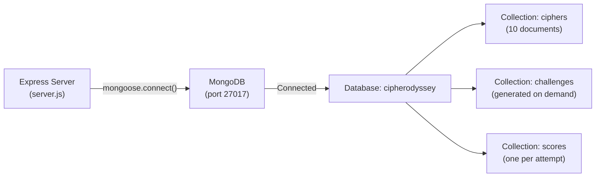

### Connection Code (in `server/server.js`)

```javascript
import mongoose from 'mongoose';

const MONGO_URI = process.env.MONGO_URI || 'mongodb://127.0.0.1:27017/cipherodyssey';

mongoose
  .connect(MONGO_URI)
  .then(() => {
    console.log(`[MongoDB] Connected successfully to ${MONGO_URI}`);
    app.listen(PORT, '0.0.0.0', () => {
      console.log(`[Express] CipherOdyssey API server listening on http://localhost:${PORT}`);
    });
  })
  .catch((err) => {
    console.error('[MongoDB] Connection error:', err);
    process.exit(1);
  });
```

**Key points:**
1. The server uses Mongoose to connect to MongoDB at `mongodb://127.0.0.1:27017/cipherodyssey`
2. The database name is `cipherodyssey` (the part after the last `/`)
3. The Express server only starts listening for HTTP requests **after** the database connection succeeds
4. If MongoDB is unreachable, the server exits with an error

### Three Mongoose Models (Schemas)

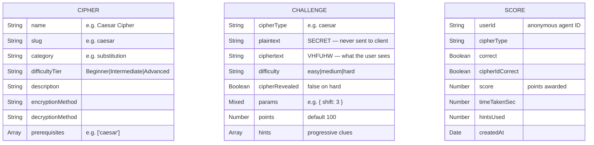

### Data Flow: Who Reads/Writes What

| Operation | Who | Collection | Read/Write |
|:---|:---|:---|:---|
| Seed 10 ciphers | `seedCiphers.js` script | `ciphers` | Write |
| List cipher catalog | `GET /api/ciphers` | `ciphers` | Read |
| Generate a challenge | `GET /api/challenges/random` | `challenges` | Write |
| Submit an answer | `POST /api/challenges/:id/submit` | `challenges` + `scores` | Read + Write |
| View stats | `GET /api/scores/summary` | `scores` | Read |

---

# 4. Backend

## Structure

The backend is a standalone Node.js application inside the `/server` directory with its own `package.json`:

```
server/
├── server.js              ← Entry point: starts Express + connects to MongoDB
├── .env                   ← Environment variables (MONGO_URI, PORT)
├── package.json           ← Backend dependencies
├── routes/
│   └── api.js             ← Route definitions: maps URLs to controllers
├── controllers/
│   ├── cipherController.js    ← Handles cipher catalog queries
│   ├── challengeController.js ← Generates challenges + validates answers
│   ├── scoreController.js     ← Logs scores + calculates summaries
│   └── achievementController.js ← Evaluates badge criteria
├── models/
│   ├── Cipher.js          ← Mongoose schema for cipher metadata
│   ├── Challenge.js       ← Mongoose schema for generated challenges
│   └── Score.js           ← Mongoose schema for user attempts
├── utils/
│   ├── cipherEngine.js    ← Re-exports shared/cipherEngine.js
│   ├── wordBank.js        ← Re-exports shared/wordBank.js with difficulty selectors
│   └── scoring.js         ← Authoritative scoring calculations
├── scripts/
│   └── seedCiphers.js     ← Populates MongoDB with 10 ciphers
└── test/
    ├── api.test.js        ← API integration tests (6 tests)
    └── cipherEngine.test.js ← Cipher algorithm tests (10 tests)
```

## MVC Pattern

The backend follows the **Model–View–Controller** pattern:

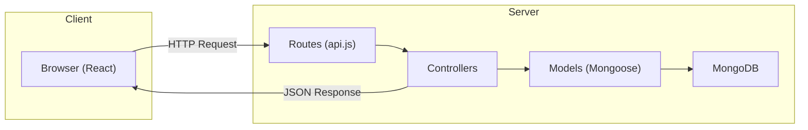

- **Models** (`models/`) — Define the shape of data in MongoDB
- **Controllers** (`controllers/`) — Contain business logic (generate challenges, validate answers, calculate scores)
- **Routes** (`routes/api.js`) — Map URL paths to the correct controller function

## Anti-Cheat: Payload Sanitization

When the server sends a challenge to the client, it **strips the plaintext answer and encryption parameters**:

```javascript
// What gets stored in MongoDB:
{
  cipherType: 'caesar',
  plaintext: 'ATTACK AT DAWN',   // ← SECRET
  ciphertext: 'DWWDFN DW GDZQ',
  params: { shift: 3 },          // ← SECRET
  hints: ['...', '...', '...'],
}

// What gets sent to the browser:
{
  id: '66e0a1b2...',
  cipherType: 'caesar',
  ciphertext: 'DWWDFN DW GDZQ',
  hints: ['...', '...', '...'],
  // plaintext: STRIPPED
  // params: STRIPPED
}
```

The user cannot cheat by inspecting network responses. When they submit an answer, the server looks up the challenge by its MongoDB `_id` and compares against the stored plaintext.

---

# 5. API, Node & Express

## What is Express?

Express is a minimal web framework for Node.js. It handles:
1. **Receiving** HTTP requests from the browser
2. **Routing** them to the correct handler function based on the URL path and HTTP method
3. **Sending** JSON responses back

## Middleware Chain

Every request passes through middleware in order:

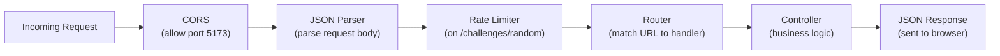

## Complete API Reference

### `GET /api/health`
**Purpose:** Health check to verify the server is running.
**Response:**
```json
{ "status": "ok", "timestamp": "2026-09-12T17:00:00.000Z" }
```

---

### `GET /api/ciphers`
**Purpose:** Returns the full catalog of 10 ciphers.
**Response:**
```json
{
  "success": true,
  "count": 10,
  "data": [
    {
      "name": "Caesar Cipher",
      "slug": "caesar",
      "category": "Monoalphabetic Substitution",
      "difficultyTier": "Beginner",
      "description": "Shifts each letter by a fixed integer across the alphabet.",
      "encryptionMethod": "E(x) = (x + k) mod 26",
      "decryptionMethod": "D(y) = (y - k + 26) mod 26",
      "prerequisites": []
    }
    // ... 9 more ciphers
  ]
}
```

---

### `GET /api/ciphers/:slug`
**Purpose:** Returns details for a single cipher by its slug.
**Example:** `GET /api/ciphers/vigenere`
**Response:**
```json
{
  "success": true,
  "data": {
    "name": "Vigenère Cipher",
    "slug": "vigenere",
    "category": "Polyalphabetic Substitution",
    "difficultyTier": "Intermediate",
    "description": "Repeats a keyword to apply variable Caesar shifts across each position.",
    "encryptionMethod": "E(x_i) = (x_i + k_(i mod m)) mod 26",
    "decryptionMethod": "D(y_i) = (y_i - k_(i mod m) + 26) mod 26",
    "prerequisites": ["caesar", "rot13"]
  }
}
```

---

### `GET /api/challenges/random?difficulty=easy|medium|hard&cipher=`
**Purpose:** Generates a random challenge, stores it in MongoDB, and returns a sanitized version (no plaintext).
**Rate Limited:** 60 requests per minute via `express-rate-limit`.
**Response:**
```json
{
  "success": true,
  "challenge": {
    "id": "66e0a1b2c3d4e5f6a7b8c9d0",
    "cipherType": "caesar",
    "cipherRevealed": true,
    "difficulty": "easy",
    "ciphertext": "DWWDFN DW GDZQ",
    "hints": [
      "Monoalphabetic shift: every letter moved by a fixed distance.",
      "The letter 'A' enciphers to 'D'.",
      "The secret key is a forward shift of +3."
    ],
    "points": 100,
    "createdAt": "2026-09-12T17:00:00.000Z"
  }
}
```

---

### `POST /api/challenges/:id/submit`
**Purpose:** Validates the user's answer against the stored plaintext and persists a Score record.
**Request Body:**
```json
{
  "answer": "ATTACK AT DAWN",
  "cipherGuess": "caesar",
  "hintsUsed": 0,
  "timeTakenSec": 12,
  "userId": "agent_abc123"
}
```
**Response (correct):**
```json
{
  "success": true,
  "correct": true,
  "cipherIdCorrect": false,
  "pointsAwarded": 150,
  "breakdown": [
    { "label": "BASE DECRYPT REWARD", "delta": 100 },
    { "label": "RAPID INTERCEPT (<15s)", "delta": 25 },
    { "label": "ZERO-HINT PROTOCOL BONUS", "delta": 25 }
  ],
  "scoreId": "66e0a1b2c3d4e5f6a7b8c9d1",
  "expected": "ATTACK AT DAWN"
```
**Response (incorrect):**
```json
{
  "success": true,
  "correct": false,
  "cipherIdCorrect": false,
  "pointsAwarded": -10,
  "breakdown": [
    { "label": "COMPROMISED DECRYPTION", "delta": -10 }
  ],
  "scoreId": "66e0a1b2c3d4e5f6a7b8c9d2"
}
```

---

### `GET /api/scores/summary?userId=...`
**Purpose:** Aggregates all scores for a user — total score, accuracy, streak records, per-cipher solve count, and mastery levels.
**Response:**
```json
{
  "success": true,
  "userId": "agent_abc123",
  "summary": {
    "totalScore": 450,
    "totalAttempts": 5,
    "totalSolved": 4,
    "accuracy": 80,
    "currentStreak": 2,
    "bestStreak": 3,
    "cipherSolves": {
      "caesar": 3,
      "atbash": 1
    },
    "cipherMastery": {
      "caesar": 99,
      "atbash": 33
    }
  }
}
```

---

### `GET /api/achievements?userId=...`
**Purpose:** Evaluates which achievements a user has unlocked based on their score records.
**Response:**
```json
{
  "success": true,
  "userId": "agent_abc123",
  "achievements": [
    {
      "id": "first_decryption",
      "title": "First Decryption",
      "badge": "STAGE 01",
      "description": "Intercept and successfully decode your first transmission.",
      "unlocked": true
    },
    {
      "id": "caesar_master",
      "title": "Caesar Master",
      "badge": "LEGION",
      "description": "Master the Caesar shift cipher with at least 3 verified field decryptions.",
      "unlocked": true
    }
  ],
  "unlockedCount": 2
}
```

---

## Scoring Logic

| Event | Points |
|:---|:---|
| Correct decode | **+100** |
| Identified hidden cipher correctly | **+50** |
| Fast answer (< 15 seconds) | **+25** |
| No hints used | **+25** |
| Wrong answer | **-10** |
| Per hint used | **-20** |

Maximum possible per challenge: **+200** (correct + cipher ID + fast + no hints)

---

# 6. Full Architecture

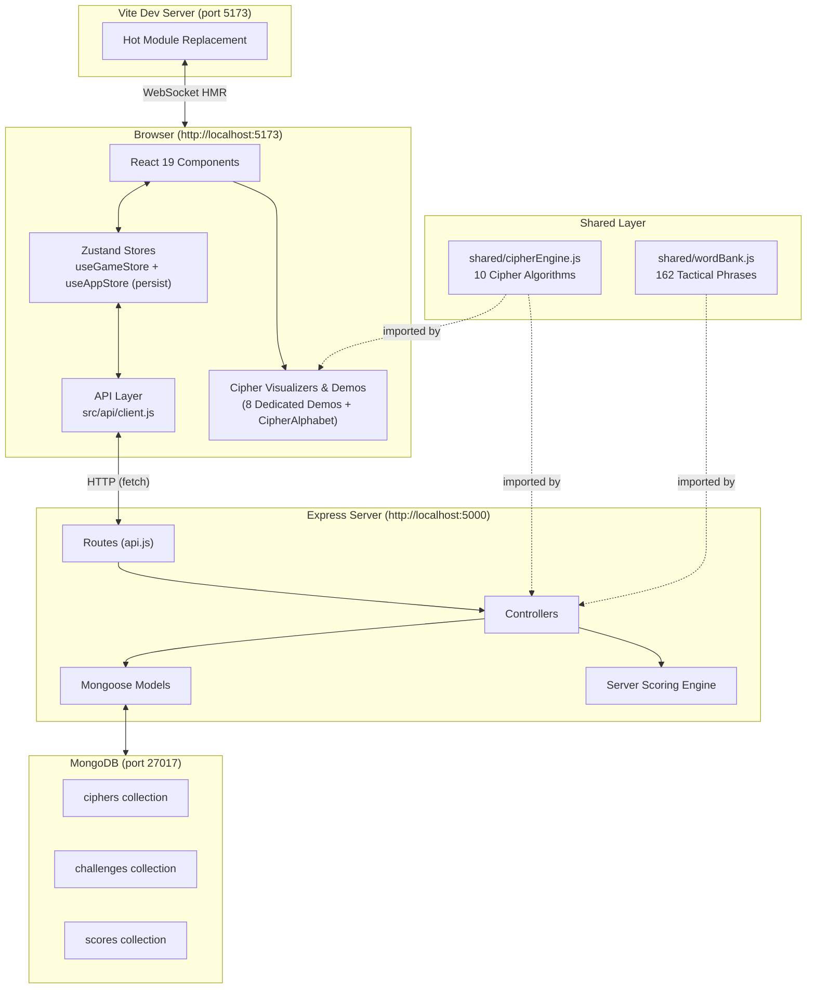

### Architecture Key Points

1. **Three Independent Processes**: MongoDB (port 27017), Express API (port 5000), and Vite (port 5173) run as separate OS processes.

2. **Shared Canonical Code**: Both `shared/cipherEngine.js` and `shared/wordBank.js` serve as the single source of truth across client and server. Client and server import the same algorithms and phrase dictionaries, preventing drift.

3. **CORS Bridge**: The Express server explicitly allows requests from `http://localhost:5173` (the Vite dev origin). Without this, the browser would block cross-origin requests.

4. **Optimistic UI with Background Reconciliation**: The frontend doesn't block UI on server confirmation. It immediately projects score rewards and streak increments in `useGameStore`, then asynchronously sends payloads to Express. The server verifies against MongoDB and the client silently reconciles any discrepancies.

5. **Local Persistence with Refresh Replay**: Mastery and achievements persist indefinitely across browser reloads via Zustand `persist` with `localStorage`. In contrast, introductory hero animations (`hasPlayedIntro`) remain memory-only so interactive animations replay on page refresh.

6. **Exhaustive File Calling Documentation**: For an in-depth file-to-file calling map and end-to-end trace diagram, refer to [FILE_CALLS.md](file:///home/sjh/cipher/FILE_CALLS.md).

---

# 7. Workflow

## Workflow 1: User Learns a Cipher

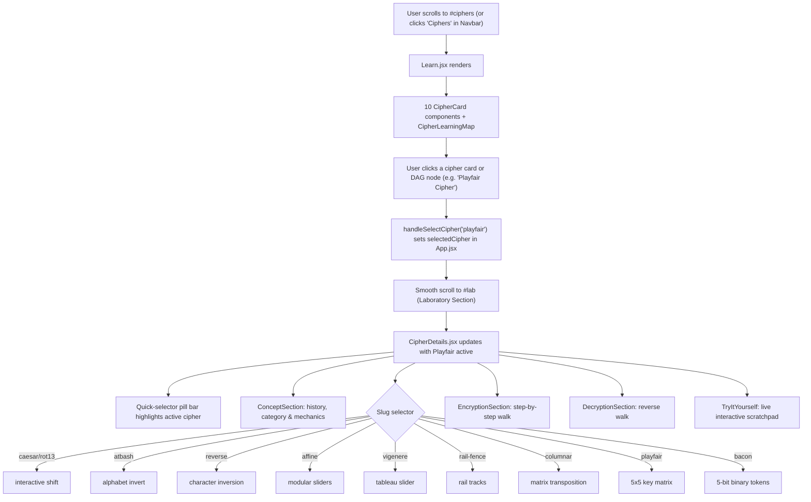

## Workflow 2: User Plays a Challenge

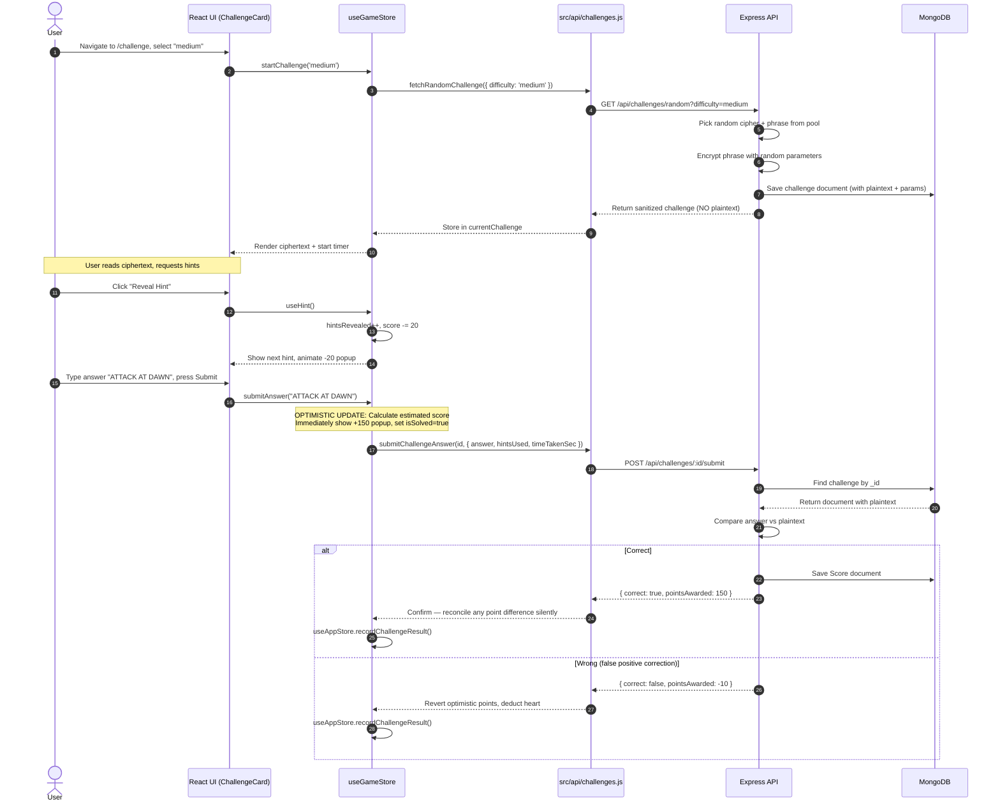

## Workflow 3: Achievement Unlock

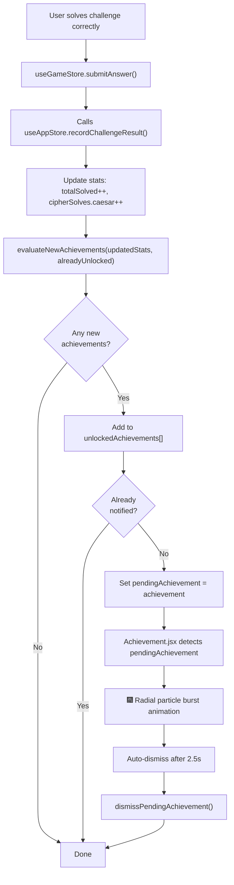

## Workflow 4: Cipher Mastery & DAG Unlock

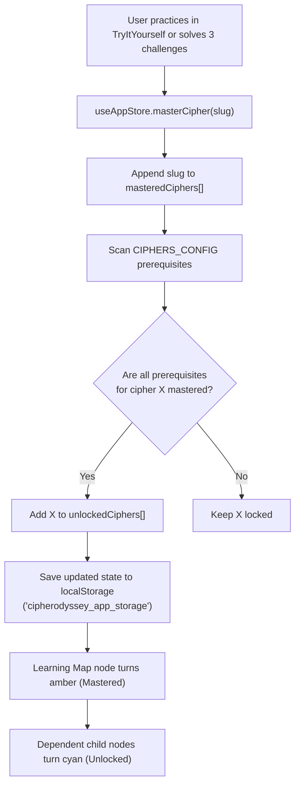

## Workflow 5: Reset Progress

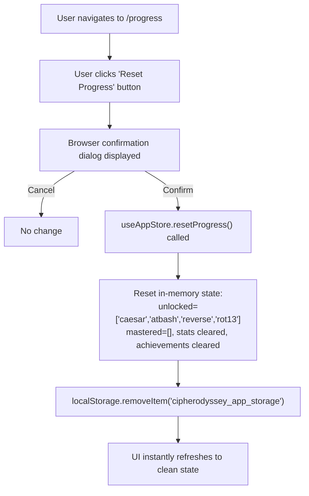

### Five Achievements

| ID | Name | Criteria |
|:---|:---|:---|
| `first_decryption` | First Decryption | Solve 1 challenge |
| `code_breaker` | Code Breaker | Solve 10 challenges |
| `caesar_master` | Caesar Master | Solve 3 Caesar cipher challenges |
| `no_hint` | No Hint | Solve 5 challenges without using any hints |
| `cryptologist` | Cryptologist | Achieve 90%+ accuracy with 5+ attempts |

---

# 8. File Structure

```
/home/sjh/cipher/
│
├── .gitignore                 # Files to exclude from git
├── index.html                 # HTML shell — mounts React
├── package.json               # Frontend dependencies + scripts
├── vite.config.js             # Vite build configuration
├── README.md                  # Project overview & quickstart
├── DOCUMENTATION.md           # Comprehensive technical manual
├── FILE_CALLS.md              # Exhaustive file-to-file calling & architecture map
│
├── shared/                    # ═══ SHARED CANONICAL LAYER ═══
│   ├── cipherEngine.js        # 10 cipher algorithms (single source of truth)
│   └── wordBank.js            # 162-phrase tactical dictionary & word pools
│
├── src/                       # ═══ FRONTEND ═══
│   ├── main.jsx               # React entry point
│   ├── App.jsx                # Root single-page layout & scrollspy
│   │
│   ├── styles/
│   │   └── tokens.css         # Design tokens (colors, fonts, keyframes)
│   │
│   ├── data/
│   │   ├── ciphersConfig.js   # Static cipher metadata + DAG prerequisites
│   │   └── cipherLessons.js   # Structured curricula for all 10 ciphers
│   │
│   ├── api/                   # Network layer
│   │   ├── client.js          # Base HTTP client + user session
│   │   ├── ciphers.js         # Cipher catalog API calls
│   │   ├── challenges.js      # Challenge generation + submission API calls
│   │   └── scores.js          # Score summary + achievements API calls
│   │
│   ├── store/                 # State management
│   │   ├── useAppStore.js     # Persistent progress + achievements (Zustand persist)
│   │   └── useGameStore.js    # Active gameplay session
│   │
│   ├── utils/                 # Helpers
│   │   ├── cipherHelpers.js   # Re-exports shared/cipherEngine.js
│   │   ├── scoring.js         # Client-side score estimation
│   │   ├── challengeGenerator.js # Offline fallback generator
│   │   ├── achievements.js    # Badge criteria evaluation
│   │   ├── animationVariants.js # Framer Motion presets
│   │   └── wordBank.js        # Re-exports shared/wordBank.js
│   │
│   ├── components/            # Reusable UI components
│   │   ├── Navbar.jsx
│   │   ├── AnimatedBackground.jsx
│   │   ├── TypingHeadline.jsx
│   │   ├── CipherCard.jsx
│   │   ├── CipherLearningMap.jsx
│   │   ├── CipherAlphabet.jsx
│   │   ├── LetterMap.jsx
│   │   ├── TryItYourself.jsx
│   │   ├── ChallengeCard.jsx
│   │   ├── HintBox.jsx
│   │   ├── ScorePopup.jsx
│   │   ├── ProgressBar.jsx
│   │   ├── Achievement.jsx
│   │   ├── demos/             # Dedicated interactive cipher demos
│   │   │   ├── AffineControls.jsx
│   │   │   ├── AtbashMirror.jsx
│   │   │   ├── BaconBinaryReveal.jsx
│   │   │   ├── ColumnarGrid.jsx
│   │   │   ├── PlayfairGrid.jsx
│   │   │   ├── RailFenceZigzag.jsx
│   │   │   ├── ReverseDemo.jsx
│   │   │   └── VigenereKeyInput.jsx
│   │   └── sections/
│   │       ├── ConceptSection.jsx
│   │       ├── EncryptionSection.jsx
│   │       └── DecryptionSection.jsx
│   │
│   └── pages/                 # Section-level components
│       ├── Home.jsx           # Hero section (#hero)
│       ├── Learn.jsx          # Ciphers library section (#ciphers)
│       ├── CipherDetails.jsx  # Interactive laboratory workbench (#lab)
│       ├── Challenge.jsx      # Challenge game arena section (#challenge)
│       └── Progress.jsx       # Stats & achievements section (#progress)
│
├── server/                    # ═══ BACKEND ═══
│   ├── server.js              # Express entry point
│   ├── .env                   # Environment variables
│   ├── package.json           # Backend dependencies
│   │
│   ├── routes/
│   │   └── api.js             # All API route definitions
│   │
│   ├── models/
│   │   ├── Cipher.js          # Cipher schema
│   │   ├── Challenge.js       # Challenge schema
│   │   └── Score.js           # Score schema
│   │
│   ├── controllers/
│   │   ├── cipherController.js
│   │   ├── challengeController.js
│   │   ├── scoreController.js
│   │   └── achievementController.js
│   │
│   ├── utils/
│   │   ├── cipherEngine.js    # Re-exports shared/cipherEngine.js
│   │   ├── wordBank.js        # Re-exports shared/wordBank.js
│   │   └── scoring.js         # Server scoring logic
│   │
│   ├── scripts/
│   │   └── seedCiphers.js     # Database seeder (ciphers, challenges, scores)
│   │
│   └── test/
│       ├── api.test.js        # API tests (6 tests)
│       └── cipherEngine.test.js # Cipher tests (10 tests)
│
├── test/                      # ═══ FRONTEND TESTS (19 tests) ═══
│   ├── ciphers.test.js        # Cipher round-trip tests (10 tests)
│   ├── gameplay.test.js       # Game loop & scoring tests (4 tests)
│   ├── achievements.test.js   # Achievement evaluation & guard tests (2 tests)
│   └── lessons.test.js        # Lesson curricula & mastery store tests (3 tests)
│
└── data/                      # ═══ LOCAL DATABASE ═══
    ├── db/                    # MongoDB data directory
    └── mongod.log             # MongoDB log file
```

---

# 9. Detailed File-by-File Explanation

## Root Configuration Files

### `index.html`
The single HTML page that the browser loads. Contains:
- Google Fonts links for **JetBrains Mono** (ciphertext font) and **Inter** (UI font)
- A `<div id="root">` where React mounts the entire application
- The Vite `<script type="module">` tag that loads `src/main.jsx`

### `package.json`
Declares the frontend project identity and dependencies:
- **Scripts**: `dev` (start Vite), `build` (production compile), `preview` (serve production build), `test` (run 19 client tests), `seed` (seed MongoDB database)
- **Dependencies**: react, react-dom, zustand, framer-motion, lucide-react, clsx, tailwind-merge

### `vite.config.js`
Configures the Vite build tool:
- Activates the React plugin (enables JSX and Fast Refresh)
- Activates the Tailwind CSS v4 plugin (compiles utility classes)
- Sets dev server to port 5173
- **Ignores** `data/`, `server/`, and `*.log` files from the file watcher to prevent MongoDB database writes from triggering page reloads

### `.gitignore`
Lists files that git should not track: `node_modules/`, `dist/`, `data/`, `*.log`, `.env`

---

## Shared Layer

### `shared/cipherEngine.js`
**Purpose:** The single canonical implementation of all 10 cipher algorithms. Both frontend interactive demos and backend answer verification import directly from this file, guaranteeing zero logic divergence.

**Contains 20 exported functions (encode + decode for each):**

| Cipher | Encode Function | Decode Function | Algorithm |
|:---|:---|:---|:---|
| Caesar | `caesarEncode(text, shift)` | `caesarDecode(text, shift)` | Shift each letter by `shift` positions (mod 26) |
| Atbash | `atbashEncode(text)` | `atbashDecode(text)` | Mirror the alphabet: A↔Z, B↔Y, etc. |
| Reverse | `reverseEncode(text)` | `reverseDecode(text)` | Reverse the string character by character |
| ROT13 | `rot13Encode(text)` | `rot13Decode(text)` | Caesar shift with fixed shift of 13 |
| Affine | `affineEncode(text, a, b)` | `affineDecode(text, a, b)` | E(x) = (ax + b) mod 26, requires modular inverse |
| Vigenère | `vigenereEncode(text, key)` | `vigenereDecode(text, key)` | Polyalphabetic: different shift per position based on keyword |
| Columnar | `columnarEncode(text, key)` | `columnarDecode(text, key)` | Write into grid, read columns in alphabetical key order |
| Rail Fence | `railFenceEncode(text, rails)` | `railFenceDecode(text, rails)` | Write in zigzag pattern across `rails` rows, read row by row |
| Playfair | `playfairEncode(text, key)` | `playfairDecode(text, key)` | 5×5 matrix, digraph substitution with row/column/rectangle rules |
| Bacon | `baconEncode(text)` | `baconDecode(text)` | Each letter → 5-bit binary using A and B characters |

### `shared/wordBank.js`
**Purpose:** The canonical 162-phrase tactical word bank shared by client and server:
- `SHORT_WORDS` (66 words) — Rapid single-word intercepts (e.g., `ALPHA`, `CIPHER`, `SHIELD`, `VECTOR`)
- `MEDIUM_WORDS` (60 words) — Intermediate polysyllabic vocabulary (e.g., `ALGORITHM`, `CLASSIFIED`, `SURVEILLANCE`)
- `TACTICAL_PHRASES` (36 phrases) — Classical historical and intelligence phrases (e.g., `ATTACK AT DAWN`, `VENI VIDI VICI`, `BLACK CHAMBER`)
- `getPhraseForDifficulty(difficulty)` — Selects balanced phrases for easy, medium, and hard challenges

---

## Frontend: Entry & Layout

### `src/main.jsx`
Creates the React root and renders the app. Directly renders `<App />` inside:
- `<React.StrictMode>` — Enables additional development checks and warnings

### `src/App.jsx`
The root single-page container and layout controller. Coordinates:
- `<Navbar />` — Fixed top navigation bar with active section indicator, mobile menu drawer, and smooth navigation triggers
- `activeSection` state — Tracks current viewport position (`hero`, `ciphers`, `lab`, `challenge`, `progress`) via passive scroll listener
- `selectedCipher` state — Controls the active cipher loaded into the `#lab` workbench
- `scrollToSection(id)` — Handles smooth scrolling to any section ID with a 64px navbar offset compensation
- Vertical layout of all five sections (`#hero`, `#ciphers`, `#lab`, `#challenge`, `#progress`)
- Application `<footer>` with status indicator, quick section jumps, and Back-to-Top button

---

## Frontend: Styles & Data

### `src/styles/tokens.css`
Defines the design system using CSS custom properties and Tailwind v4's `@theme` directive:

| Token | Value | Usage |
|:---|:---|:---|
| `--bg-void` | `#0A0E14` | Deep dark background |
| `--bg-panel` | `#111826` | Card and panel backgrounds |
| `--ink-primary` | `#E8ECF1` | Primary text color |
| `--ink-dim` | `#5C6B7A` | Dimmed/secondary text |
| `--signal-amber` | `#E8A33D` | Active states, keys, warnings, mastery |
| `--signal-cyan` | `#4FD1C5` | Success states, streaks, unlocked |
| `--signal-red` | `#E5484D` | Errors, hearts, penalties |

### `src/data/ciphersConfig.js`
Static configuration array of all 10 ciphers. Each entry contains:
- `name`, `slug`, `category`, `difficultyTier`
- `formula` — Mathematical notation (e.g., `E(x) = (x + k) mod 26`)
- `history` — Historical context paragraph
- `sampleText` — Example text for interactive demos
- `prerequisites` — Array of cipher slugs that must be mastered first (used to build the DAG learning map)

### `src/data/cipherLessons.js`
Comprehensive curricular dictionary covering all 10 ciphers. Provides structured lesson content used across `ConceptSection.jsx`, `EncryptionSection.jsx`, `DecryptionSection.jsx`, and `TryItYourself.jsx`.

---

## Frontend: API Layer

### `src/api/client.js`
Central HTTP client. All API calls go through this module:
- `request(endpoint, options)` — Prepends `http://localhost:5000/api`, sets JSON headers, parses responses, throws on errors
- `getOrCreateUserId()` — Generates an anonymous user ID (`cq_agent_id`) and stores it in `localStorage` so the session is tracked consistently

### `src/api/challenges.js`
Functions for interacting with the challenges API:
- `fetchRandomChallenge({ difficulty, cipher })` — Calls `GET /api/challenges/random` and transforms the response
- `submitChallengeAnswer(challengeId, { answer, cipherGuess, hintsUsed, timeTakenSec })` — Calls `POST /api/challenges/:id/submit`

### `src/api/ciphers.js`
Wrappers for `GET /api/ciphers` and `GET /api/ciphers/:slug`.

### `src/api/scores.js`
Wrappers for `POST /api/scores`, `GET /api/scores/summary`, and `GET /api/achievements`.

---

## Frontend: State Stores

### `src/store/useGameStore.js`
The active gameplay session engine (memory-only):
- `startChallenge(difficulty)` — Fetches a random challenge from the API (falls back to local generator if offline)
- `submitAnswer(rawAnswer)` — **Optimistic update**: immediately animates the score popup and increments streak, then asynchronously verifies with server
- `identifyCipherGuess(slug)` — Evaluates cipher identification guesses on hard challenges (+50 on correct, -10 on wrong)
- `useHint()` — Reveals next hint, applies -20 penalty
- `nextChallenge()` — Fetches a new challenge
- `resetGame()` — Resets score, streak, and hearts

### `src/store/useAppStore.js`
Persistent progress tracker using Zustand's `persist` middleware with `localStorage` (storage key: `'cipherodyssey_app_storage'`):
- `partialize` persists: `unlockedCiphers`, `masteredCiphers`, `stats`, `unlockedAchievements`, `notifiedAchievements`
- `hasPlayedIntro` is deliberately **excluded** from `partialize` so that hero animations (`TypingHeadline`) play on every page refresh
- `recordChallengeResult()` — Updates lifetime stats, checks achievements, auto-masters ciphers at 3 verified solves
- `masterCipher(slug)` — Marks cipher as mastered and automatically unlocks dependent children in the prerequisite DAG
- `resetProgress()` — Wipes store state back to initial default and removes `'cipherodyssey_app_storage'` from `localStorage`

---

## Frontend: Utilities

### `src/utils/cipherHelpers.js`
Re-exports functions from `shared/cipherEngine.js` with helper methods for dynamic cipher encoding and decoding in interactive practice modules.

### `src/utils/wordBank.js`
Re-exports word arrays and helper methods from `shared/wordBank.js`.

### `src/utils/scoring.js`
Client-side score calculation. Used for optimistic UI updates before server confirmation.

### `src/utils/challengeGenerator.js`
Offline fallback generator. Generates challenges locally using the shared cipher engine if the API server is unreachable.

### `src/utils/achievements.js`
Defines the 5 achievements and provides `evaluateNewAchievements(stats, alreadyUnlocked)` to identify newly unlocked badges.

### `src/utils/animationVariants.js`
Pre-defined Framer Motion transition objects shared across components: spring physics, pop-in scales, shake variants, and `prefers-reduced-motion` fallbacks.

---

## Frontend: Components

### `src/components/Navbar.jsx`
Top navigation bar. Uses Framer Motion's `layoutId="activeTabIndicator"` to create a smoothly sliding amber indicator following the active route.

### `src/components/AnimatedBackground.jsx`
Decorative background on the Home page:
- A CSS grid that slowly drifts via `background-position`
- 34 floating cipher symbols (Σ, λ, ⊕, etc.) drifting with Framer Motion `repeat: Infinity`
- Respects `prefers-reduced-motion`

### `src/components/TypingHeadline.jsx`
Typewriter effect for the hero headline. Types "Master the machinery of classical cryptography." at 32ms per character, then fades in subtext and CTA buttons. Animation replays cleanly on every page refresh.

### `src/components/CipherCard.jsx`
Interactive card in the cipher catalog with unique animations per cipher and status indicators (locked, unlocked, mastered).

### `src/components/CipherLearningMap.jsx`
Interactive SVG directed acyclic graph (DAG) visualizing cipher relationships, prerequisites, and learning progression paths.

### `src/components/demos/` — Dedicated Cipher Demos
Each of the classical ciphers features a purpose-built interactive visualizer:
- `AffineControls.jsx` — Interactive sliders for slope `a` (coprime to 26) and intercept `b`
- `AtbashMirror.jsx` — Visual alphabet inversion pairing (A↔Z, B↔Y)
- `BaconBinaryReveal.jsx` — 5-bit binary representation toggling between plain, binary, and A/B steganography
- `ColumnarGrid.jsx` — Matrix arrangement showing row insertion and alphabetical key column readout
- `PlayfairGrid.jsx` — 5×5 keyed polybius matrix highlighting digraph pairs and transformation rules
- `RailFenceZigzag.jsx` — Zigzag wave visualization showing rail traversal
- `ReverseDemo.jsx` — Character-by-character linear inversion animation
- `VigenereKeyInput.jsx` — Polyalphabetic tabula recta lookup with interactive keyword alignment

### `src/components/CipherAlphabet.jsx`
Draggable slider (0–25) with two parallel alphabet rows for Caesar and ROT13 ciphers, using `useMotionValue` and `useTransform`.

### `src/components/LetterMap.jsx`
Reusable widget showing a single letter substitution (e.g., "H → K") with spring animation.

### `src/components/TryItYourself.jsx`
Interactive scratchpad where users type plaintext and see live cipher output. Implements synchronous streak validation (`nextStreak = streak + 1`) to ensure instant mastery on first solve.

### `src/components/ChallengeCard.jsx`
The main gameplay console:
- Displays ciphertext in large amber monospace text
- Heart meter with animated break-away on wrong answers
- Input field with shake animation
- Point breakdown and cipher identification dropdown for hard mode

### `src/components/HintBox.jsx`
Progressive disclosure accordion revealing up to 3 hints with animated auto-height expansion.

### `src/components/ScorePopup.jsx`
Floating toast queue for point rewards (+100, +50, +25) and penalties (-10, -20).

### `src/components/ProgressBar.jsx`
Per-cipher mastery progress bars displaying mastery percentages, solves, and shimmer skeletons during telemetry fetches.

### `src/components/Achievement.jsx`
- `AchievementUnlockModal` — Radial particle burst celebration for newly unlocked badges
- `AchievementShelfCard` — Static badge card displaying locked/unlocked state

### `src/components/sections/`
- `ConceptSection.jsx` — Historical context, mathematical formulas, and cryptanalysis vulnerabilities
- `EncryptionSection.jsx` — Step-by-step interactive encryption walkthrough
- `DecryptionSection.jsx` — Step-by-step reverse decryption walkthrough

---

## Frontend: Pages & Section Components

### `src/pages/Home.jsx`
Renders the Hero section (`#hero`): `AnimatedBackground` and `TypingHeadline` with smooth-scroll CTA buttons targeting `#challenge` and `#ciphers`. Introductory typing headline animation replays on every browser refresh.

### `src/pages/Learn.jsx`
Renders the Ciphers section (`#ciphers`): cipher catalog hub providing toggle between `CipherCard` grid and interactive SVG `CipherLearningMap`. Clicking any cipher card or node selects the cipher and smoothly scrolls down to `#lab`.

### `src/pages/CipherDetails.jsx`
Renders the Laboratory section (`#lab`): full-featured interactive cryptography workbench. Features:
- Horizontal quick-selector pill bar with status badges across all 10 ciphers
- Active dedicated interactive visualizer (`AffineControls`, `AtbashMirror`, `BaconBinaryReveal`, `ColumnarGrid`, `PlayfairGrid`, `RailFenceZigzag`, `ReverseDemo`, `VigenereKeyInput`, or `CipherAlphabet`)
- `ConceptSection` with historical context, mathematical formulas, and cryptanalysis notes
- `EncryptionSection` and `DecryptionSection` step-by-step walkthroughs
- `TryItYourself` live scratchpad with instant mastery unlocking on verified solve

### `src/pages/Challenge.jsx`
Renders the Challenge Arena section (`#challenge`): intercepted transmissions console with HUD bar (score, streak, difficulty selector, skip button), `ChallengeCard`, `HintBox`, and `ScorePopup`.

### `src/pages/Progress.jsx`
Renders the Progress section (`#progress`): dashboard showing lifetime verified score, accuracy, streak records, per-cipher progress bars, and achievement shelf. Features a **"Reset Progress"** button with confirmation dialog.

---

## Backend: Server Core

### `server/server.js`
Entry point. Loads environment variables, configures CORS for Vite, mounts routes under `/api`, connects to MongoDB at `mongodb://127.0.0.1:27017/cipherodyssey`, and listens on port 5000.

### `server/routes/api.js`
Central route definitions mapping HTTP methods to controllers with rate limiting on `/challenges/random`.

---

## Backend: Controllers

### `server/controllers/cipherController.js`
- `getAllCiphers()` — Queries all cipher documents sorted by difficulty tier
- `getCipherBySlug(slug)` — Queries a single cipher by slug

### `server/controllers/challengeController.js`
- `getRandomChallenge()` — Generates random challenge, encrypts phrase, persists to MongoDB, returns sanitized challenge
- `submitChallengeAnswer()` — Compares answer against stored plaintext, calculates authoritative score, persists Score record

### `server/controllers/scoreController.js`
- `createScore()` — Saves a raw score record
- `getScoreSummary()` — Aggregates total score, solved count, accuracy, streaks, and per-cipher mastery

### `server/controllers/achievementController.js`
- `getUserAchievements()` — Evaluates score history against achievement criteria

---

## Backend: Other Files

### `server/utils/scoring.js`
Authoritative server scoring engine.

### `server/utils/wordBank.js`
Re-exports `shared/wordBank.js` with difficulty selectors.

### `server/utils/cipherEngine.js`
Re-exports `shared/cipherEngine.js`.

### `server/scripts/seedCiphers.js`
Connects to MongoDB, clears `ciphers`, `challenges`, and `scores` collections, and seeds the 10 canonical ciphers.

---

## Test Files

### `test/ciphers.test.js` (10 tests)
Verifies round-trip encoding and decoding for all 10 classical ciphers.

### `test/gameplay.test.js` (4 tests)
Tests challenge generation difficulty constraints, scoring logic, 10-challenge continuous solve loops, and heart deduction.

### `test/achievements.test.js` (2 tests)
Tests achievement badge evaluation and single-trigger notification guards.

### `test/lessons.test.js` (3 tests)
Tests lesson curricula completeness across all 10 ciphers, dynamic TryItYourself helpers, and store mastery persistence.

### `server/test/api.test.js` (6 tests)
Integration tests for health check, cipher catalog, challenge sanitization, submission scoring, and score summaries.

### `server/test/cipherEngine.test.js` (10 tests)
Verifies server-side cipher algorithm parity with the shared canonical engine.

---

# 10. Flowcharts

## Application Startup Flow

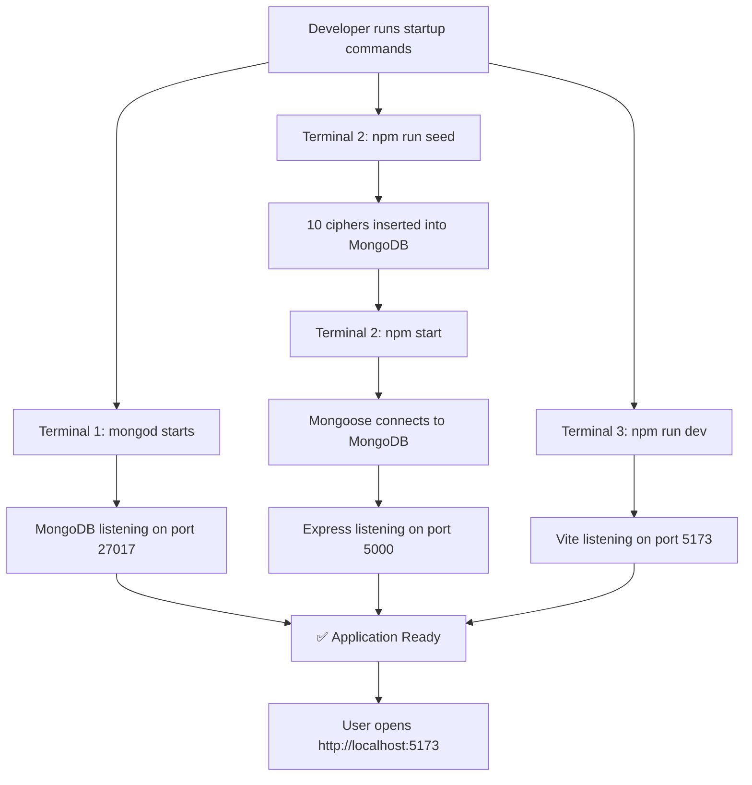

## Request Lifecycle

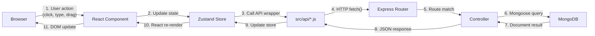

## Data Flow: Challenge Gameplay

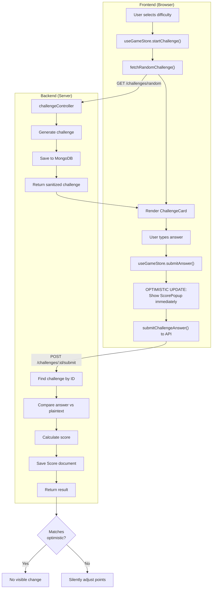

## Component Rendering Hierarchy

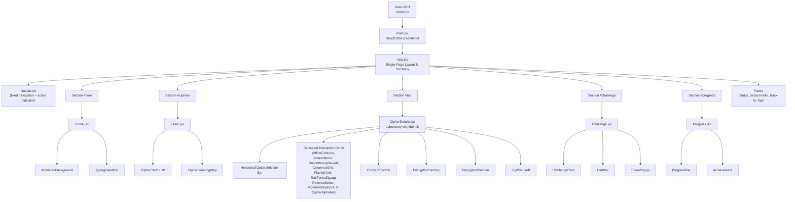

---

# 11. Terminal Commands — Start & Stop

## Starting the Application

### Step 1: Start MongoDB (Terminal 1)

```bash
cd /home/sjh/cipher
mkdir -p data/db
mongod --dbpath ./data/db --bind_ip 127.0.0.1 --port 27017
```

> [!NOTE]
> If you get `exitCode: 48`, MongoDB is already running. Skip this step.

**To verify MongoDB is running:**
```bash
mongosh --eval "db.adminCommand('ping')"
# Expected output: { ok: 1 }
```

### Step 2: Seed Database + Start Backend (Terminal 2)

```bash
cd /home/sjh/cipher/server

# First time only (or to reset database):
npm run seed

# Start the Express API server:
npm start
```

**To verify the API is running:**
```bash
curl http://localhost:5000/api/health
# Expected output: {"status":"ok","timestamp":"..."}
```

### Step 3: Start Frontend (Terminal 3)

```bash
cd /home/sjh/cipher
npm run dev
```

**Open in browser:** `http://localhost:5173`

### Quick-Start (All in One Terminal)

```bash
cd /home/sjh/cipher

# Start MongoDB in background
mkdir -p data/db
mongod --dbpath ./data/db --bind_ip 127.0.0.1 --port 27017 --logpath ./data/mongod.log --fork

# Start backend in background
cd server && npm start &

# Start frontend (foreground)
cd .. && npm run dev
```

---

## Stopping the Application

### If running in separate terminals:
Press **`Ctrl + C`** in each terminal:
1. Terminal 3 (Vite) → `Ctrl + C`
2. Terminal 2 (Express) → `Ctrl + C`
3. Terminal 1 (MongoDB) → `Ctrl + C`

### If running in background:

```bash
# Stop Vite
pkill -f "vite"

# Stop Express
pkill -f "node server.js"

# Stop MongoDB (graceful shutdown)
mongod --dbpath /home/sjh/cipher/data/db --shutdown
```

### Nuclear Stop (kill everything):

```bash
pkill -f "vite" 2>/dev/null
pkill -f "node server.js" 2>/dev/null
pkill -f "mongod.*27017" 2>/dev/null
```

### Verify Everything Stopped:

```bash
lsof -i :27017 -i :5000 -i :5173
# If fully stopped, this returns empty output
```

---

## Running Tests

```bash
# Frontend tests (19 tests):
cd /home/sjh/cipher
npm test

# Backend tests (16 tests):
cd /home/sjh/cipher/server
npm test

# All 35 tests together:
cd /home/sjh/cipher && npm test && cd server && npm test
```

## Production Build

```bash
cd /home/sjh/cipher

# Compile optimized bundle:
npm run build

# Preview production build locally:
npm run preview
```

---

## Port Summary

| Service | Port | Protocol |
|:---|:---|:---|
| MongoDB | 27017 | TCP (MongoDB wire protocol) |
| Express API | 5000 | HTTP |
| Vite Dev Server | 5173 | HTTP + WebSocket (HMR) |

---

# 12. File-to-File Calling Architecture

For the complete technical breakdown of how every file connects to every other file across all three tiers, refer to [FILE_CALLS.md](file:///home/sjh/cipher/FILE_CALLS.md).

### High-Level Calling Chain Summary

```
User Action
  └─→ React Pages (Home, Learn, CipherDetails, Challenge, Progress)
        └─→ Zustand Stores (useGameStore, useAppStore)
              └─→ Frontend API Client (challenges.js, ciphers.js, scores.js)
                    └─→ HTTP Fetch (client.js → http://localhost:5000/api)
                          └─→ Express Server (server.js → routes/api.js)
                                └─→ Controllers (cipher, challenge, score, achievement)
                                      └─→ Mongoose Models (Cipher, Challenge, Score)
                                            └─→ MongoDB (mongodb://127.0.0.1:27017/cipherodyssey)
```

### 1) How Frontend Requests Data
- **Pages** ([`Challenge.jsx`](file:///home/sjh/cipher/src/pages/Challenge.jsx), [`Progress.jsx`](file:///home/sjh/cipher/src/pages/Progress.jsx)) dispatch actions to stores.
- **Store Actions** (`startChallenge()`, `submitAnswer()`) initiate asynchronous calls through API helper modules.
- **Offline / Local state** (`useAppStore`) loads and updates directly from `localStorage` (`'cipherodyssey_app_storage'`) without network round-trips for unlock status and mastery checks.

### 2) How Frontend Calls Backend
- [`client.js`](file:///home/sjh/cipher/src/api/client.js) manages `API_BASE = 'http://localhost:5000/api'`, automatically injects JSON headers, handles browser agent session IDs (`cq_agent_id`), and formats exceptions.
- Domain modules ([`challenges.js`](file:///home/sjh/cipher/src/api/challenges.js), [`ciphers.js`](file:///home/sjh/cipher/src/api/ciphers.js), [`scores.js`](file:///home/sjh/cipher/src/api/scores.js)) provide strongly typed async functions returning clean domain objects.

### 3) How Backend Responds to Frontend
- Express routes in [`server/routes/api.js`](file:///home/sjh/cipher/server/routes/api.js) parse URL parameters and JSON payloads, applying rate limiting where appropriate.
- Controllers sanitize outgoing challenge data by stripping plaintext and secret transformation keys before sending JSON responses back to Vite.
- All JSON responses follow consistent shapes with `success: true/false`, status codes (`200`, `201`, `400`, `404`, `500`), and descriptive breakdown objects.

### 4) How Backend Calls Database
- Controllers interact with MongoDB strictly through Mongoose models:
  - [`Cipher.js`](file:///home/sjh/cipher/server/models/Cipher.js) — Querying cipher specifications and DAG dependencies.
  - [`Challenge.js`](file:///home/sjh/cipher/server/models/Challenge.js) — Persisting generated challenges with hidden plaintext and hints.
  - [`Score.js`](file:///home/sjh/cipher/server/models/Score.js) — Recording user attempts, score points, accuracy telemetry, and computing real-time leaderboard summaries and badge unlocks.

See [FILE_CALLS.md](file:///home/sjh/cipher/FILE_CALLS.md) for full interactive Mermaid sequence diagrams and the complete caller/callee matrix.
