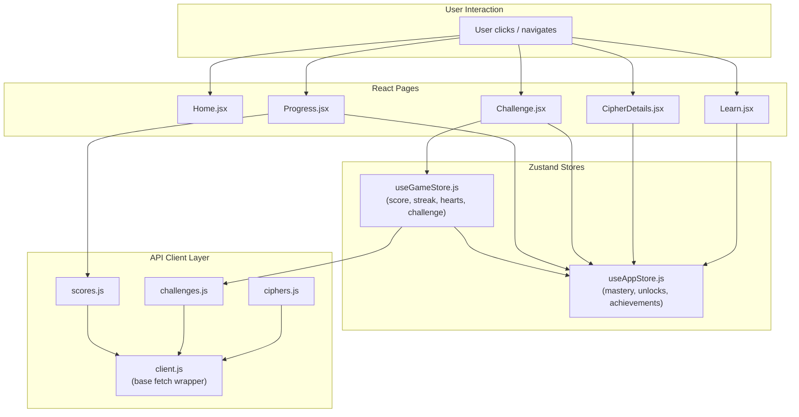
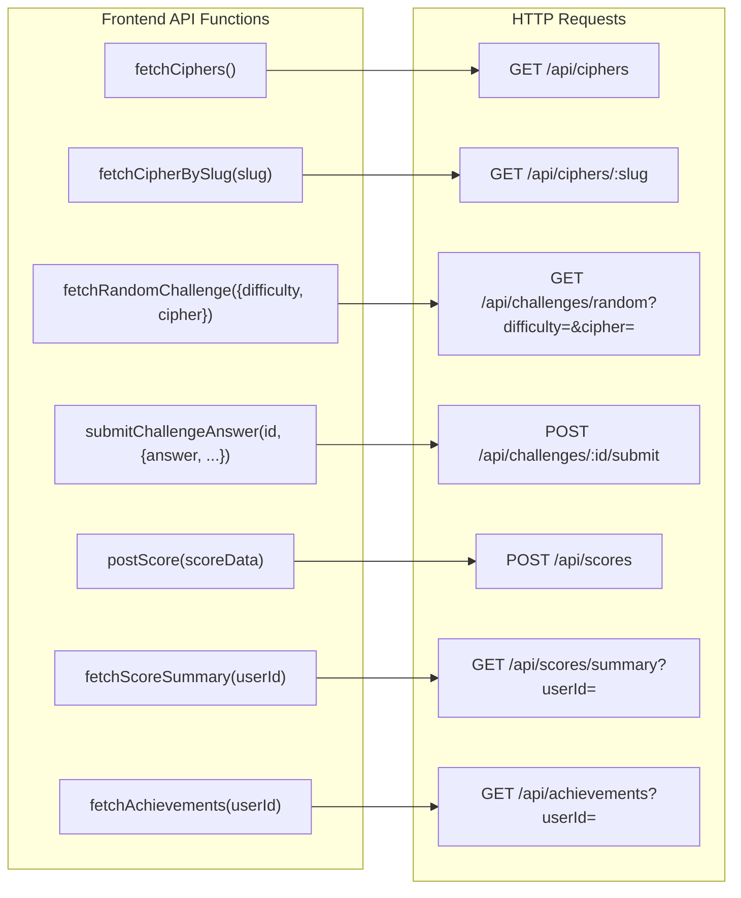
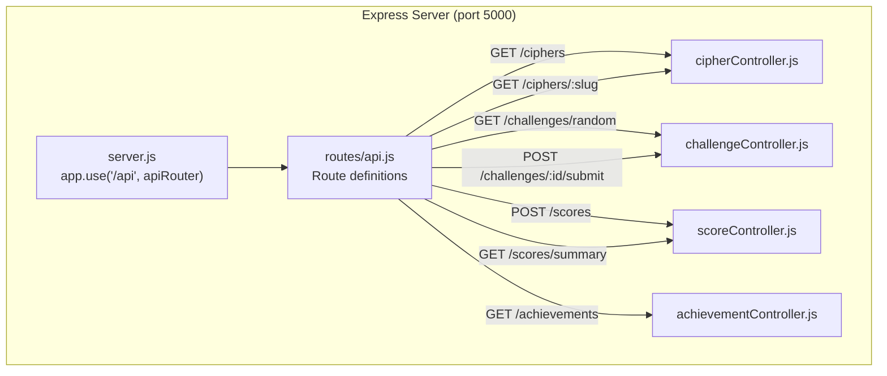
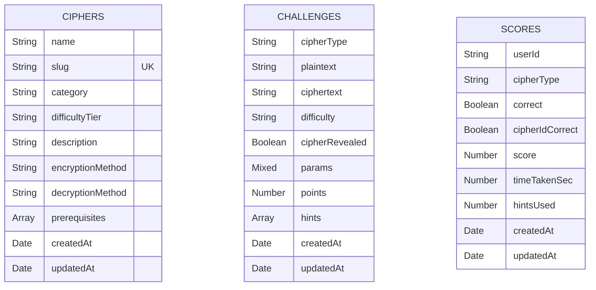
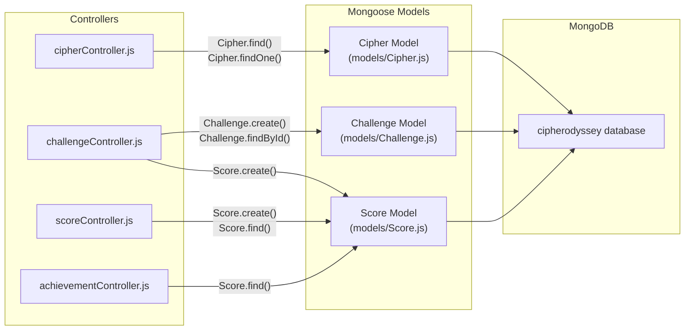
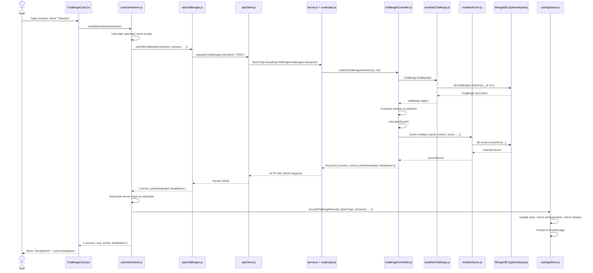

# CipherOdyssey — File Calls & Architecture

Complete mapping of how files call each other across the frontend, backend, and database layers.

---

## Project File Structure

```
cipher/
├── index.html                          ← Vite entry HTML
├── vite.config.js                      ← Vite build config
├── package.json                        ← Client dependencies & scripts
│
├── src/                                ← FRONTEND (React + Vite)
│   ├── main.jsx                        ← React root mount point
│   ├── App.jsx                         ← Single-page layout shell & scrollspy
│   │
│   ├── pages/                          ← Section-level components
│   │   ├── Home.jsx                    ← Landing hero section (#hero)
│   │   ├── Learn.jsx                   ← Cipher catalog & progress map (#ciphers)
│   │   ├── CipherDetails.jsx          ← Interactive laboratory workbench (#lab)
│   │   ├── Challenge.jsx              ← Intercepted challenge arena (#challenge)
│   │   └── Progress.jsx               ← Stats, scores & achievements (#progress)
│   │
│   ├── components/                     ← Reusable UI components
│   │   ├── Navbar.jsx                  ← Top navigation bar
│   │   ├── AnimatedBackground.jsx      ← Floating background animation
│   │   ├── TypingHeadline.jsx          ← Typing animation for home
│   │   ├── CipherCard.jsx             ← Cipher card in Learn library
│   │   ├── CipherLearningMap.jsx      ← SVG learning progress tree
│   │   ├── CipherAlphabet.jsx         ← Caesar/ROT13 alphabet demo
│   │   ├── LetterMap.jsx              ← Letter mapping visualization
│   │   ├── ChallengeCard.jsx          ← Challenge question & answer form
│   │   ├── HintBox.jsx                ← Hint reveal panel
│   │   ├── ScorePopup.jsx             ← Floating score change popups
│   │   ├── ProgressBar.jsx            ← Cipher mastery progress bars
│   │   ├── Achievement.jsx            ← Achievement cards & modal
│   │   ├── TryItYourself.jsx          ← Interactive cipher practice
│   │   ├── sections/
│   │   │   ├── ConceptSection.jsx     ← Cipher theory & explanation
│   │   │   ├── EncryptionSection.jsx  ← Encryption walkthrough
│   │   │   └── DecryptionSection.jsx  ← Decryption walkthrough
│   │   └── demos/                      ← Cipher-specific interactive demos
│   │       ├── AtbashMirror.jsx
│   │       ├── ReverseDemo.jsx
│   │       ├── AffineControls.jsx
│   │       ├── VigenereKeyInput.jsx
│   │       ├── RailFenceZigzag.jsx
│   │       ├── ColumnarGrid.jsx
│   │       ├── PlayfairGrid.jsx
│   │       └── BaconBinaryReveal.jsx
│   │
│   ├── store/                          ← Zustand state management
│   │   ├── useAppStore.js             ← Global app state (mastery, achievements)
│   │   └── useGameStore.js            ← Challenge game session state
│   │
│   ├── api/                            ← Frontend HTTP client layer
│   │   ├── client.js                  ← Base fetch wrapper (API_BASE)
│   │   ├── ciphers.js                 ← Cipher API functions
│   │   ├── challenges.js              ← Challenge API functions
│   │   └── scores.js                  ← Score & achievement API functions
│   │
│   ├── data/                           ← Static frontend data
│   │   ├── ciphersConfig.js           ← Cipher definitions & prerequisites
│   │   └── cipherLessons.js           ← Lesson curricula for all 10 ciphers
│   │
│   ├── utils/                          ← Frontend utility functions
│   │   ├── achievements.js            ← Achievement definitions & evaluation
│   │   ├── animationVariants.js       ← Framer Motion animation presets
│   │   ├── challengeGenerator.js      ← Client-side fallback challenge gen
│   │   ├── cipherHelpers.js           ← Cipher encode/decode helpers
│   │   ├── scoring.js                 ← Client-side score calculation
│   │   └── wordBank.js                ← Client-side word bank copy
│   │
│   └── styles/
│       └── tokens.css                 ← Design tokens & Tailwind config
│
├── server/                             ← BACKEND (Express + Mongoose)
│   ├── server.js                      ← Express app, MongoDB connect, CORS
│   ├── routes/
│   │   └── api.js                     ← Route definitions → controllers
│   ├── controllers/
│   │   ├── cipherController.js        ← GET ciphers handlers
│   │   ├── challengeController.js     ← GET random & POST submit handlers
│   │   ├── scoreController.js         ← POST score & GET summary handlers
│   │   └── achievementController.js   ← GET achievements handler
│   ├── models/
│   │   ├── Cipher.js                  ← Mongoose Cipher schema
│   │   ├── Challenge.js               ← Mongoose Challenge schema
│   │   └── Score.js                   ← Mongoose Score schema
│   ├── scripts/
│   │   └── seedCiphers.js             ← Database seeding script
│   └── utils/
│       ├── cipherEngine.js            ← Server cipher encode/decode logic
│       ├── wordBank.js                ← Server phrase pool
│       └── scoring.js                 ← Server score calculation
│
├── shared/                             ← Code shared between client & server
│   ├── cipherEngine.js                ← Shared cipher encode/decode functions
│   └── wordBank.js                    ← Shared 162-word phrase pool
│
└── test/                               ← Client-side test suite
    ├── ciphers.test.js                ← Cipher engine tests
    ├── lessons.test.js                ← Lesson & mastery tests
    ├── gameplay.test.js               ← Game scoring tests
    └── achievements.test.js           ← Achievement evaluation tests
```

---

## 1) How the Frontend Requests Something

The frontend uses React pages that call Zustand stores, which in turn call API client functions.



### Request initiation by page:

| Page | What it requests | How |
|------|-----------------|-----|
| **Home.jsx** | Nothing (static) | Renders `TypingHeadline` + `AnimatedBackground` locally |
| **Learn.jsx** | Cipher unlock/mastery status | Reads from `useAppStore` (localStorage). No HTTP calls |
| **CipherDetails.jsx** | Cipher unlock/mastery status | Reads from `useAppStore`. Demos are client-side only |
| **Challenge.jsx** | Random challenges, submit answers | Calls `useGameStore.startChallenge()` → `fetchRandomChallenge()` → HTTP GET |
| **Progress.jsx** | Score summary + achievements | Calls `fetchScoreSummary()` + `fetchAchievements()` → HTTP GET |

---

## 2) How the Frontend Calls the Backend

All frontend-to-backend communication goes through the `src/api/` layer using the Fetch API.

### Base Client: `src/api/client.js`

```
API_BASE = "http://localhost:5000/api"

request(endpoint, options) → fetch(API_BASE + endpoint, { headers, ...options })
```

Every API function builds on `request()`.

### Complete API Call Map



### Detailed call chains (file → file → HTTP):

**Fetching a random challenge:**
```
Challenge.jsx
  └─→ useGameStore.startChallenge(difficulty)
        └─→ challenges.js → fetchRandomChallenge({ difficulty })
              └─→ client.js → request('/challenges/random?difficulty=easy')
                    └─→ fetch('http://localhost:5000/api/challenges/random?difficulty=easy')
```

**Submitting a challenge answer:**
```
ChallengeCard.jsx → handleSubmit()
  └─→ useGameStore.submitAnswer(rawAnswer)
        └─→ challenges.js → submitChallengeAnswer(challengeId, { answer, cipherGuess, hintsUsed, timeTakenSec })
              └─→ client.js → request('/challenges/:id/submit', { method: 'POST', body: ... })
                    └─→ fetch('http://localhost:5000/api/challenges/:id/submit', POST)
```

**Loading the Progress page:**
```
Progress.jsx → useEffect → loadTelemetry()
  ├─→ scores.js → fetchScoreSummary()
  │     └─→ client.js → request('/scores/summary?userId=...')
  │           └─→ fetch('http://localhost:5000/api/scores/summary?userId=...')
  └─→ scores.js → fetchAchievements()
        └─→ client.js → request('/achievements?userId=...')
              └─→ fetch('http://localhost:5000/api/achievements?userId=...')
```

---

## 3) How the Backend Responds to the Frontend

All backend responses are JSON with a consistent shape.

### Response Format

Every response includes `{ success: true/false, ... }`.



### Response shapes by endpoint:

| Endpoint | Controller Function | Response JSON |
|----------|-------------------|---------------|
| `GET /api/ciphers` | `getAllCiphers` | `{ success, count, data: [Cipher] }` |
| `GET /api/ciphers/:slug` | `getCipherBySlug` | `{ success, data: Cipher }` |
| `GET /api/challenges/random` | `getRandomChallenge` | `{ success, challenge: { id, cipherType, difficulty, ciphertext, hints, points, ... } }` |
| `POST /api/challenges/:id/submit` | `submitChallengeAnswer` | `{ success, correct, cipherIdCorrect, pointsAwarded, breakdown, scoreId }` |
| `POST /api/scores` | `createScore` | `{ success, data: Score }` |
| `GET /api/scores/summary` | `getScoreSummary` | `{ success, userId, summary: { totalScore, totalAttempts, totalSolved, accuracy, currentStreak, bestStreak, cipherSolves, cipherMastery } }` |
| `GET /api/achievements` | `getUserAchievements` | `{ success, userId, achievements: [{ id, title, badge, description, unlocked }], unlockedCount }` |

### Error responses:
```json
{ "success": false, "error": "Error message string" }
```
With appropriate HTTP status codes: `400` (bad request), `404` (not found), `500` (server error).

---

## 4) How the Backend Calls the Database

The backend uses **Mongoose** (MongoDB ODM) to interact with the **cipherodyssey** MongoDB database.

### Connection

```
server.js → mongoose.connect('mongodb://127.0.0.1:27017/cipherodyssey')
```

### Database Collections & Schemas



### Controller → Model → MongoDB call map:



### Detailed database operations by controller:

**cipherController.js:**
```
getAllCiphers()     → Cipher.find({}).sort({ difficultyTier: 1, name: 1 })
getCipherBySlug()  → Cipher.findOne({ slug: slug.toLowerCase() })
```

**challengeController.js:**
```
getRandomChallenge()    → Challenge.create({ cipherType, plaintext, ciphertext, ... })
submitChallengeAnswer() → Challenge.findById(id)
                        → Score.create({ userId, cipherType, correct, score, ... })
```

**scoreController.js:**
```
createScore()      → Score.create({ userId, cipherType, correct, score, ... })
getScoreSummary()  → Score.find({ userId }).sort({ createdAt: 1 })
```

**achievementController.js:**
```
getUserAchievements() → Score.find({ userId })
                      → Evaluates ACHIEVEMENTS_SPEC against aggregated stats
```

---

## Full End-to-End Call Diagram

This diagram traces a complete flow from user click to database and back.

### Example: User solves a challenge



---

## Summary of Which File Calls Which

| Caller | Calls | Purpose |
|--------|-------|---------|
| `main.jsx` | `App.jsx` | Mounts React root component |
| `App.jsx` | `Navbar.jsx`, `Home.jsx`, `Learn.jsx`, `CipherDetails.jsx`, `Challenge.jsx`, `Progress.jsx` | Orchestrates single-page vertical sections, activeSection scrollspy & selectedCipher state |
| `Challenge.jsx` | `useGameStore`, `useAppStore`, `ChallengeCard`, `HintBox`, `ScorePopup` | Game page orchestration |
| `ChallengeCard.jsx` | `useGameStore.submitAnswer()`, `useGameStore.identifyCipherGuess()` | User input handling |
| `useGameStore.js` | `api/challenges.js`, `useAppStore.js`, `utils/scoring.js`, `utils/challengeGenerator.js` | Game logic + API calls |
| `useAppStore.js` | `data/ciphersConfig.js`, `utils/achievements.js` | State management + persistence |
| `Progress.jsx` | `api/scores.js`, `useAppStore`, `useGameStore` | Stats dashboard |
| `api/challenges.js` | `api/client.js`, `data/ciphersConfig.js` | HTTP challenge requests |
| `api/ciphers.js` | `api/client.js` | HTTP cipher requests |
| `api/scores.js` | `api/client.js` | HTTP score/achievement requests |
| `api/client.js` | `fetch()` (browser) | Base HTTP wrapper → `localhost:5000/api` |
| `server.js` | `routes/api.js`, `mongoose`, `cors`, `express` | Server bootstrap |
| `routes/api.js` | `cipherController`, `challengeController`, `scoreController`, `achievementController` | Route → controller mapping |
| `cipherController.js` | `models/Cipher.js` | DB reads for cipher data |
| `challengeController.js` | `models/Challenge.js`, `models/Score.js`, `utils/cipherEngine.js`, `utils/scoring.js`, `utils/wordBank.js` | Challenge generation + grading |
| `scoreController.js` | `models/Score.js` | Score CRUD + aggregation |
| `achievementController.js` | `models/Score.js` | Achievement evaluation from scores |
| `models/Cipher.js` | `mongoose` | MongoDB Cipher schema |
| `models/Challenge.js` | `mongoose` | MongoDB Challenge schema |
| `models/Score.js` | `mongoose` | MongoDB Score schema |
| `CipherDetails.jsx` | `ConceptSection`, `EncryptionSection`, `DecryptionSection`, `TryItYourself`, cipher demos | Lesson page composition |
| `TryItYourself.jsx` | `shared/cipherEngine.js`, `useAppStore.masterCipher()` | Practice + mastery unlock |
| `Learn.jsx` | `useAppStore`, `CipherCard`, `CipherLearningMap`, `data/ciphersConfig.js` | Library page |
