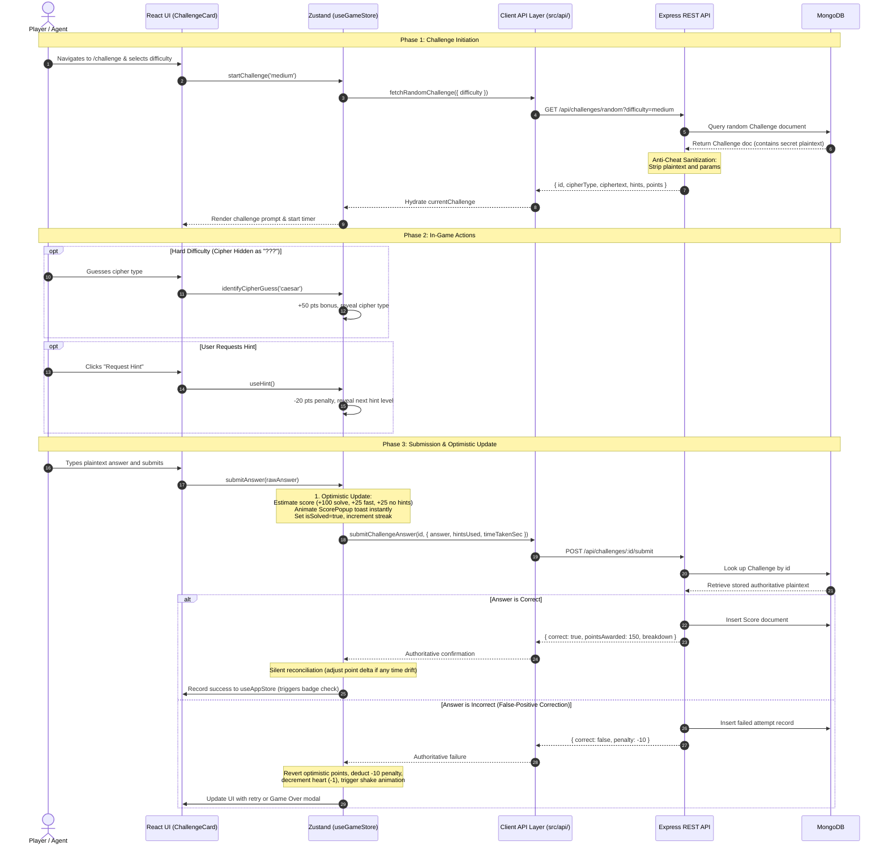

# CipherQuest: Classical Cryptography Laboratory

> **An interactive, gamified classical cryptography laboratory built with React 19, Vite, Tailwind CSS v4, Framer Motion, Zustand, Node.js, Express, and MongoDB.**
> 
> *Pedagogical Flow: Learn → Practice → Decode → Score → Progress*

---

## Table of Contents
1. [Overview & Concept](#overview--concept)
2. [Prerequisites & System Requirements](#prerequisites--system-requirements)
3. [Full Procedure & Commands to Start the Application](#full-procedure--commands-to-start-the-application)
   - [Terminal 1: Start MongoDB Daemon](#terminal-1-start-mongodb-daemon)
   - [Terminal 2: Seed Database & Start Express API Server](#terminal-2-seed-database--start-express-api-server)
   - [Terminal 3: Start Frontend Vite Dev Server](#terminal-3-start-frontend-vite-dev-server)
   - [Single-Terminal / Background Startup](#single-terminal--background-startup)
   - [Production Build & Preview](#production-build--preview)
   - [Running Automated Test Suites](#running-automated-test-suites)
4. [Tech Stack & Architecture](#tech-stack--architecture)
5. [Design System & Aesthetic Guidelines](#design-system--aesthetic-guidelines)
6. [Complete Project Directory Structure](#complete-project-directory-structure)
7. [End-to-End Application Flow & Data Lifecycle](#end-to-end-application-flow--data-lifecycle)
   - [Flow 1: Learning & Interactive Visualizers](#flow-1-learning--interactive-visualizers)
   - [Flow 2: Challenge Gameplay, Optimistic Updates & Server Reconciliation](#flow-2-challenge-gameplay-optimistic-updates--server-reconciliation)
   - [Flow 3: Telemetry, Mastery & Achievement Celebration](#flow-3-telemetry-mastery--achievement-celebration)
8. [Comprehensive File-by-File Breakdown](#comprehensive-file-by-file-breakdown)
   - [Root Configuration Files](#root-configuration-files)
   - [Canonical Cryptography Engine (`shared/`)](#canonical-cryptography-engine-shared)
   - [Frontend Source Files (`src/`)](#frontend-source-files-src)
   - [Backend API Server Files (`server/`)](#backend-api-server-files-server)
   - [Automated Test Suites (`test/` & `server/test/`)](#automated-test-suites-test--servertest)
9. [Authoritative REST API Reference](#authoritative-rest-api-reference)

---

## Overview & Concept

CipherQuest moves away from clichéd "matrix green terminal" tropes and bright modern SaaS gradients, instead embodying an **analog research laboratory**: dark slate instrument panels, amber oscilloscope accents, cyan data traces, and monospace mechanical readouts.

The application trains users in 10 classical ciphers spanning four major historical families:
1. **Monoalphabetic Substitution**: Caesar, Atbash, Reverse, ROT13, Affine
2. **Polyalphabetic Substitution**: Vigenère
3. **Transposition**: Columnar Transposition, Rail Fence
4. **Polybius & Steganographic Systems**: Playfair, Baconian Cipher

---

## Prerequisites & System Requirements

- **Node.js**: `v20.x` or `v24.x` (ES modules enabled)
- **MongoDB**: `v7.x` or `v8.x` installed locally (`mongod` command available)
- **Package Manager**: `npm` (comes bundled with Node.js)
- **Available Ports**:
  - `27017` for MongoDB
  - `5000` for the Node.js Express API server
  - `5173` for the Vite frontend development server

---

## Full Procedure & Commands to Start the Application

Follow these steps using three separate terminal windows or tabs:

### Terminal 1: Start MongoDB Daemon
Create the local data directory and start the MongoDB database daemon:

```bash
# Navigate to the project root
cd /home/sjh/cipher

# Ensure the database storage directory exists
mkdir -p data/db

# Start mongod (foreground)
mongod --dbpath ./data/db --bind_ip 127.0.0.1 --port 27017
```

*(Alternatively, run mongod in the background with logging)*:
```bash
mongod --dbpath /home/sjh/cipher/data/db --bind_ip 127.0.0.1 --port 27017 --logpath /home/sjh/cipher/data/mongod.log --fork
```

---

### Terminal 2: Seed Database & Start Express API Server
The backend requires the database to be seeded with the 10 cipher definitions on initial run:

```bash
cd /home/sjh/cipher/server

# 1. Seed the 10 cipher specifications into MongoDB
npm run seed

# 2. Start the Express API server (listens on http://localhost:5000)
npm start
```

*Verification Check:*
```bash
curl http://localhost:5000/api/health
# Expected Output: {"status":"ok","timestamp":"..."}
```

---

### Terminal 3: Start Frontend Vite Dev Server
Launch the React 19 development server with Hot Module Replacement (HMR):

```bash
cd /home/sjh/cipher

# Start the Vite dev server (listens on http://localhost:5173)
npm run dev
```

Open your browser and navigate to:
**`http://localhost:5173`**

---

### Single-Terminal / Background Startup
If you wish to launch all three services simultaneously from a single shell:

```bash
cd /home/sjh/cipher

# 1. Launch MongoDB daemon in the background
mkdir -p data/db
mongod --dbpath ./data/db --bind_ip 127.0.0.1 --port 27017 --logpath ./data/mongod.log --fork

# 2. Seed database & start API in background
cd server && npm run seed && node server.js &

# 3. Start Frontend dev server
cd .. && npm run dev
```

To stop all background processes when finished:
```bash
pkill -f "mongod.*27017"
pkill -f "node server.js"
pkill -f "vite"
```

---

### Production Build & Preview
To compile the optimized production bundle and serve it locally:

```bash
cd /home/sjh/cipher

# Compile bundle into /dist
npm run build

# Preview production build locally
npm run preview
```

---

### Running Automated Test Suites
CipherQuest includes 32 native automated tests verifying encryption algorithms, scoring logic, session loops, and backend API integration:

```bash
# Run client unit tests (16 tests)
cd /home/sjh/cipher
npm test

# Run server API & engine tests (16 tests)
cd /home/sjh/cipher/server
npm test

# Run all 32 tests across client and server
npm test && cd server && npm test
```

---

## Tech Stack & Architecture

### Frontend Layer
- **React 19 (`react`, `react-dom`)**: Next-gen UI rendering with strict concurrent safety.
- **Vite 6 (`vite`, `@vitejs/plugin-react`)**: Ultra-fast build tool and development server.
- **Tailwind CSS v4 (`@tailwindcss/vite`, `tailwindcss`)**: High-performance CSS framework with CSS-first variable configuration.
- **Framer Motion 12 (`framer-motion`)**: Drives hardware-accelerated micro-interactions, `layoutId` indicator transitions, and `useMotionValue` + `useTransform` zero-rerender slider kinematics.
- **Zustand 5 (`zustand`)**: Lightweight, decoupled state management separating global persistent progress (`useAppStore`) from transient real-time game loops (`useGameStore`).
- **React Router 7 (`react-router-dom`)**: Declarative client-side routing.
- **Lucide React (`lucide-react`)**: Clean, minimalist iconography.

### Shared Cryptographic Engine
- **Canonical Module (`shared/cipherEngine.js`)**: Framework-free, pure ES module implementing all cipher algorithms. Imported identically by both frontend visualizers and backend evaluation logic to guarantee **zero logic drift**.

### Backend Layer
- **Node.js 24**: Modern JavaScript runtime utilizing native ES modules (`"type": "module"`).
- **Express 4 (`express`)**: REST API server providing endpoint routing, JSON payload parsing, and error boundaries.
- **CORS (`cors`)**: Restricts cross-origin resource sharing strictly to Vite's dev origin (`http://localhost:5173`).
- **Mongoose 8 (`mongoose`)**: Object Data Modeling (ODM) library for MongoDB.
- **nanoid (`nanoid`)**: Fast, URL-friendly unique ID generator.
- **dotenv (`dotenv`)**: Environment variable configuration.

### Database Layer
- **MongoDB v8**: Document-oriented database persisting cipher catalogs, generated challenges, and detailed user score records.

---

## Design System & Aesthetic Guidelines

CipherQuest adheres strictly to an **analog cryptography lab** aesthetic:

| Design Token | CSS Variable | Hex Value | Semantic Usage |
| :--- | :--- | :--- | :--- |
| **Void Background** | `--bg-void` | `#0A0E14` | Deep black/slate base canvas |
| **Elevated Surface** | `--bg-panel` | `#111826` | Card backgrounds, console enclosures |
| **Primary Ink** | `--ink-primary` | `#E8ECF1` | Main body typography, headers, cipher letters |
| **Dimmed Ink** | `--ink-dim` | `#5C6B7A` | Sub-labels, borders, inactive states, grid lines |
| **Signal Amber** | `--signal-amber` | `#E8A33D` | Active slider keys, focus outlines, warning prompts |
| **Signal Cyan** | `--signal-cyan` | `#4FD1C5` | Correct solves, successful telemetry, streaks |
| **Signal Red** | `--signal-red` | `#E5484D` | Heart loss, penalties, incorrect answers |

### Typography Pairing
- **`JetBrains Mono`**: Ciphertext, keys, shift numbers, mathematical formulas, telemetry metrics.
- **`Inter`**: UI headers, instructions, descriptions, prose, and button labels.

### Accessibility
All interactive animations respect user system preferences. When `prefers-reduced-motion` is enabled, continuous animations (canvas grid drift, pulsating dials, rail bouncing) automatically fall back to static, accessible states.

---

## Complete Project Directory Structure

```text
/home/sjh/cipher/
├── data/                                # Local database files & runtime logs
│   ├── db/                              # MongoDB database data directory
│   └── mongod.log                       # MongoDB log output
├── index.html                           # Single-page application HTML entrypoint
├── package.json                         # Client scripts, dependencies & configurations
├── vite.config.js                       # Vite 6 + React + Tailwind v4 config
│
├── shared/                              # Single source of truth for cryptographic logic
│   └── cipherEngine.js                  # 10 canonical ciphers (encode, decode, validators)
│
├── src/                                 # Frontend application source code
│   ├── main.jsx                         # React root mount point
│   ├── App.jsx                          # Root layout, router setup & persistent modals
│   │
│   ├── styles/
│   │   └── tokens.css                   # Global CSS custom properties & theme tokens
│   │
│   ├── data/
│   │   └── ciphersConfig.js             # Metadata, history, formulas & prerequisite DAG
│   │
│   ├── api/                             # Thin HTTP client wrappers
│   │   ├── client.js                    # Base request wrapper & localStorage agent session ID
│   │   ├── ciphers.js                   # API calls for cipher catalog & details
│   │   ├── challenges.js                # API calls for random challenge & answer submission
│   │   └── scores.js                    # API calls for telemetry summary & achievements
│   │
│   ├── store/                           # Zustand state stores
│   │   ├── useAppStore.js               # Cross-session progress, unlocks & achievement toast
│   │   └── useGameStore.js              # Real-time game loop, optimistic points & heart loss
│   │
│   ├── utils/                           # Client utilities & algorithmic helpers
│   │   ├── cipherHelpers.js             # Re-exports methods from shared/cipherEngine.js
│   │   ├── scoring.js                   # Client-side scoring calculation estimate
│   │   ├── challengeGenerator.js        # Offline fallback challenge generator
│   │   ├── achievements.js              # Achievement logic evaluation rules
│   │   └── animationVariants.js         # Shared Framer Motion transitions & spring configs
│   │
│   ├── components/                      # Reusable UI components & visualizers
│   │   ├── Navbar.jsx                   # Navigation header with animated layoutId active pill
│   │   ├── AnimatedBackground.jsx       # 60s drifting coordinate grid & 34 canvas particles
│   │   ├── TypingHeadline.jsx           # Single-run terminal typing sequence
│   │   ├── CipherCard.jsx               # Catalog card featuring 10 custom micro-animations
│   │   ├── CipherLearningMap.jsx        # Interactive SVG Directed Acyclic Graph (DAG)
│   │   ├── CipherAlphabet.jsx           # Draggable dual-alphabet slider with live word transforms
│   │   ├── LetterMap.jsx                # Reusable animated single-letter substitution widget
│   │   ├── TryItYourself.jsx            # Interactive scratchpad with shake/pop feedback
│   │   ├── ChallengeCard.jsx            # Console challenge terminal with animated hearts
│   │   ├── HintBox.jsx                  # Progressive disclosure hint accordion
│   │   ├── ScorePopup.jsx               # Non-colliding floating toast queue (+150, -10, etc.)
│   │   ├── ProgressBar.jsx              # 70ms staggered mastery bars with pulse shimmer
│   │   ├── Achievement.jsx              # Radial particle explosion modal & badge shelf
│   │   └── sections/                    # Modular lesson breakdown sections
│   │       ├── ConceptSection.jsx       # Historical context, vulnerabilities & math formulas
│   │       ├── EncryptionSection.jsx    # Interactive step-by-step encryptor
│   │       └── DecryptionSection.jsx    # Interactive step-by-step decryptor
│   │
│   └── pages/                           # Application page routes
│       ├── Home.jsx                     # Hero landing page & lab manifesto
│       ├── Learn.jsx                    # Catalog grid + interactive SVG roadmap view
│       ├── CipherDetails.jsx            # Individual cipher deep-dive lesson
│       ├── Challenge.jsx                # Full interactive challenge gameplay arena
│       ├── Progress.jsx                 # Live stats, mastery matrix & achievements cabinet
│       └── StyleGuide.jsx               # Design system token inspector & component sandbox
│
├── server/                              # Standalone Express + MongoDB REST API
│   ├── package.json                     # Server package configuration & scripts
│   ├── server.js                        # Express server entrypoint & MongoDB connection
│   │
│   ├── routes/
│   └── api.js                           # Central route definitions mounted under /api
│   │
│   ├── models/                          # Mongoose document schemas
│   │   ├── Cipher.js                    # Cipher model schema
│   │   ├── Challenge.js                 # Challenge model schema (authoritative plaintext stored)
│   │   └── Score.js                     # Score log schema for user attempts & stats
│   │
│   ├── controllers/                     # Route business logic handlers
│   │   ├── cipherController.js          # List ciphers & detail queries
│   │   ├── challengeController.js       # Sanitized challenge generation & answer validation
│   │   ├── scoreController.js           # Score submissions & user telemetry aggregation
│   │   └── achievementController.js     # User achievement calculations
│   │
│   ├── scripts/
│   │   └── seedCiphers.js               # Database seeder populating all 10 ciphers
│   │
│   ├── utils/                           # Backend helpers
│   │   ├── cipherEngine.js              # Server re-export of shared/cipherEngine.js
│   │   └── scoring.js                   # Authoritative backend scoring engine
│   │
│   └── test/                            # Backend integration & unit test suite
│       ├── api.test.js                  # Integration tests for endpoints & payload sanitation
│       └── cipherEngine.test.js         # Canonical cipher engine verification
│
└── test/                                # Frontend unit test suite
    ├── ciphers.test.js                  # Client cipher round-trip verification
    ├── gameplay.test.js                 # Challenge rules, store loop & heart penalties
    └── achievements.test.js             # Achievement conditions & celebration guards
```

---

## End-to-End Application Flow & Data Lifecycle



### Flow 1: Learning & Interactive Visualizers
1. User visits `/learn`, selecting between the Catalog Grid and the interactive SVG Directed Acyclic Graph (DAG) in `CipherLearningMap.jsx`.
2. Clicking a cipher routes to `/learn/:cipherId` (`CipherDetails.jsx`).
3. Interactive visualizers (e.g. `CipherAlphabet.jsx`) bind to Framer Motion values. Sliding the shift slider translates the coordinate system without re-rendering the React tree on every pixel, transforming sample words live.
4. Users test their understanding in the `TryItYourself.jsx` sandbox, receiving haptic-style error shakes on incorrect keys and success pops on match.

### Flow 2: Challenge Gameplay & Anti-Cheat
1. User enters `/challenge`.
2. `useGameStore` dispatches `fetchRandomChallenge`.
3. The Express server queries MongoDB, creates/fetches a challenge, **strips out `plaintext` and `params`**, and returns a sanitized JSON payload.
4. In the browser, the user types the answer and hits enter.
5. **Optimistic UI Execution**: To guarantee zero network stutter, the client immediately calculates an estimated score (+100 base, +25 fast time bonus if <15s, +25 no hints bonus), increments the streak, marks `isSolved = true`, and enqueues a floating `ScorePopup`.
6. In the background, the answer is verified by `POST /api/challenges/:id/submit`. If correct, any slight time-based scoring difference is silently reconciled. If incorrect, the optimistic state is reversed, a -10 penalty is applied, a heart is lost, and the card shakes.

### Flow 3: Telemetry, Mastery & Achievements
1. User navigates to `/progress` (`Progress.jsx`).
2. The page queries `GET /api/scores/summary` and `GET /api/achievements`.
3. Before data arrives, `ProgressBar.jsx` displays laboratory shimmer/pulse loading tracks (no generic spinners).
4. Once loaded, mastery bars animate with a 70ms stagger per cipher row.
5. When a badge criteria is met (e.g. *First Decryption*, *Code Breaker*, *Caesar Master*, *No Hint*, *Cryptologist*), `Achievement.jsx` triggers a radial particle explosion. A state guard ensures celebrations only fire once per unlock and never re-trigger on re-render.

---

## Comprehensive File-by-File Breakdown

### Root Configuration Files
- **`package.json`**: Frontend package declaration with scripts (`dev`, `build`, `preview`, `test`) and dependencies (`react 19`, `framer-motion 12`, `zustand 5`, `tailwindcss 4`).
- **`vite.config.js`**: Configures Vite 6 with `@vitejs/plugin-react` and `@tailwindcss/vite`, configuring `server.watch.ignored` (`data/**`, `server/**`, `*.log`) to prevent Vite from reloading when MongoDB writes logs or updates database journals.
- **`index.html`**: HTML entry importing Google Fonts (`JetBrains Mono` and `Inter`) and mounting the React root.

### Canonical Cryptography Engine (`shared/`)
- **`shared/cipherEngine.js`**: Canonical implementation of 10 ciphers:
  - `caesarEncode`, `caesarDecode`
  - `atbashEncode`, `atbashDecode`
  - `reverseEncode`, `reverseDecode`
  - `rot13Encode`, `rot13Decode`
  - `affineEncode`, `affineDecode` (includes modular inverse calculator)
  - `vigenereEncode`, `vigenereDecode`
  - `columnarEncode`, `columnarDecode`
  - `railFenceEncode`, `railFenceDecode`
  - `playfairEncode`, `playfairDecode` ($5 \times 5$ matrix, $I/J$ merge)
  - `baconEncode`, `baconDecode` (5-bit steganographic binary)

### Frontend Source Files (`src/`)

#### Styles & Data
- **`src/styles/tokens.css`**: CSS variables defining the analog lab palette, grid animations, scanlines, and typography.
- **`src/data/ciphersConfig.js`**: Comprehensive metadata for all 10 ciphers, including formulas, historical briefs, sample texts, and DAG connections.

#### API Layer (`src/api/`)
- **`src/api/client.js`**: Base fetch wrapper pointing to `http://localhost:5000/api`. Provides JSON parsing, error logging, and `getOrCreateUserId()` managing a persistent `cq_agent_id` in `localStorage`.
- **`src/api/ciphers.js`**: Client fetch wrappers for `GET /api/ciphers` and `GET /api/ciphers/:slug`.
- **`src/api/challenges.js`**: Client fetch wrappers for `GET /api/challenges/random` and `POST /api/challenges/:id/submit`.
- **`src/api/scores.js`**: Client fetch wrappers for `GET /api/scores/summary` and `GET /api/achievements`.

#### State Stores (`src/store/`)
- **`src/store/useAppStore.js`**: Manages cross-session lifetime stats (`totalSolved`, `bestStreak`, `cipherSolves`), unlocked badges, and single-trigger celebration queue.
- **`src/store/useGameStore.js`**: Manages active gameplay session state: current challenge, timer, hearts meter (5 max), hints, score popups, optimistic scoring updates, and backend response reconciliation.

#### Utilities (`src/utils/`)
- **`src/utils/cipherHelpers.js`**: Frontend re-exporter of `shared/cipherEngine.js`.
- **`src/utils/scoring.js`**: Client-side score estimation (+100 solve, +50 cipher ID, +25 fast solve, +25 no hints, -10 wrong answer, -20 per hint).
- **`src/utils/challengeGenerator.js`**: Offline client-side challenge generator fallback.
- **`src/utils/achievements.js`**: Badge definitions and unlock condition evaluation functions.
- **`src/utils/animationVariants.js`**: Shared Framer Motion springs, staggers, and reduced-motion fallback variants.

#### UI Components (`src/components/`)
- **`src/components/Navbar.jsx`**: Header navigation bar with sliding `layoutId="activeTabIndicator"` pill.
- **`src/components/AnimatedBackground.jsx`**: Canvas background with 60s slow coordinate grid drift and 34 deterministic particles.
- **`src/components/TypingHeadline.jsx`**: Typewriter headline with blinking cursor, guarded by store state to run once per session.
- **`src/components/CipherCard.jsx`**: Interactive catalog card featuring 10 distinct micro-animations.
- **`src/components/CipherLearningMap.jsx`**: Interactive SVG Directed Acyclic Graph (DAG) showing cipher progression pathways.
- **`src/components/CipherAlphabet.jsx`**: Dual-alphabet draggable shift slider driven by Framer Motion values with live character transformation.
- **`src/components/LetterMap.jsx`**: Animated single-letter replacement widget with spring physics.
- **`src/components/TryItYourself.jsx`**: Interactive encryption/decryption scratchpad with shake and pop animations.
- **`src/components/ChallengeCard.jsx`**: Main challenge terminal interface with difficulty badges, heart health meters, ciphertext display, and answer input.
- **`src/components/HintBox.jsx`**: Accordion disclosing hints one by one with animated height transitions.
- **`src/components/ScorePopup.jsx`**: Floating toast queue displaying score gains and penalties without overlapping.
- **`src/components/ProgressBar.jsx`**: Animated mastery progress bars with 70ms stagger and analog shimmer loading tracks.
- **`src/components/Achievement.jsx`**: Radial particle burst modal celebrating unlocked achievements, accompanied by a badge showcase cabinet.
- **`src/components/sections/ConceptSection.jsx`**: Formats cryptographic historical theory, vulnerability analyses, and mathematical formulas.
- **`src/components/sections/EncryptionSection.jsx`**: Step-by-step interactive encryption walkthrough.
- **`src/components/sections/DecryptionSection.jsx`**: Step-by-step interactive decryption walkthrough.

#### Pages (`src/pages/`)
- **`src/pages/Home.jsx`**: Landing page featuring lab manifesto, typing hero headline, and quick action CTAs.
- **`src/pages/Learn.jsx`**: Cipher catalog toggleable between Grid View and interactive SVG Learning Map.
- **`src/pages/CipherDetails.jsx`**: Interactive lesson page combining theory, draggable visualizers, step-by-step encryptors, and test scratchpads.
- **`src/pages/Challenge.jsx`**: Gameplay screen hosting the live console card, difficulty selectors, hint drawers, and game over screens.
- **`src/pages/Progress.jsx`**: Live telemetry dashboard displaying score aggregations, mastery bars, and earned achievement badges.
- **`src/pages/StyleGuide.jsx`**: Design system testbed showcasing palette tokens, typography scales, and UI components.

---

### Backend API Server Files (`server/`)
- **`server/package.json`**: Server package dependencies (`express`, `mongoose`, `cors`, `nanoid`, `dotenv`) and scripts (`start`, `seed`, `test`).
- **`server/server.js`**: Server initialization: loads `.env`, configures CORS, connects to MongoDB, mounts `/api`, and starts Express on port `5000`.
- **`server/routes/api.js`**: Declares all REST endpoints and binds them to their respective controllers.
- **`server/models/Cipher.js`**: Mongoose schema for ciphers (`name`, `slug`, `category`, `difficultyTier`, `description`, `encryptionMethod`, `decryptionMethod`, `prerequisites`).
- **`server/models/Challenge.js`**: Mongoose schema for challenges (`cipherType`, `plaintext`, `ciphertext`, `difficulty`, `cipherRevealed`, `params`, `points`, `hints`).
- **`server/models/Score.js`**: Mongoose schema for user attempts (`userId`, `cipherType`, `correct`, `cipherIdCorrect`, `score`, `timeTakenSec`, `hintsUsed`, `createdAt`).
- **`server/controllers/cipherController.js`**: Queries and returns the cipher catalog and single cipher documents.
- **`server/controllers/challengeController.js`**: Generates challenges, persists them to MongoDB, **strips out secret plaintexts/keys**, and authoritatively scores submissions.
- **`server/controllers/scoreController.js`**: Aggregates solve metrics (accuracy rate, average time, total score, per-cipher mastery percentages).
- **`server/controllers/achievementController.js`**: Evaluates user score records to determine unlocked achievements.
- **`server/scripts/seedCiphers.js`**: Standalone seed script populating MongoDB with all 10 ciphers.
- **`server/utils/cipherEngine.js`**: Server-side re-exporter of `shared/cipherEngine.js`.
- **`server/utils/scoring.js`**: Authoritative backend scoring engine matching client-side scoring rules.

---

### Automated Test Suites (`test/` & `server/test/`)
- **`test/ciphers.test.js`**: 10 tests verifying encoding and decoding round-trips for every cipher.
- **`test/achievements.test.js`**: Tests verifying badge conditions and confirming single-trigger celebration modal guards.
- **`test/gameplay.test.js`**: Tests verifying challenge difficulty constraints, scoring tables, a 10-challenge continuous solve loop, and heart loss penalties.
- **`server/test/cipherEngine.test.js`**: 10 tests verifying backend parity with the canonical cryptography engine.
- **`server/test/api.test.js`**: 6 integration tests verifying health checks, cipher catalog listings, challenge sanitization (no plaintext leaks), submission scoring, and user telemetry aggregation.

---

## Authoritative REST API Reference

All backend routes are mounted under the `/api` prefix:

| Method | Endpoint | Description | Request Query / Body | Response Payload |
| :--- | :--- | :--- | :--- | :--- |
| `GET` | `/api/health` | Service health check | None | `{"status": "ok", "timestamp": "..."}` |
| `GET` | `/api/ciphers` | Retrieve all 10 seeded ciphers | None | `{"success": true, "ciphers": [...]}` |
| `GET` | `/api/ciphers/:slug` | Retrieve single cipher details | URL param `:slug` | `{"success": true, "cipher": {...}}` |
| `GET` | `/api/challenges/random` | Get a random challenge *(sanitized)* | `?difficulty=easy\|medium\|hard` | `{"success": true, "challenge": { "id", "cipherType", "ciphertext", "difficulty", "cipherRevealed", "hints", "points" }}` |
| `POST` | `/api/challenges/:id/submit` | Submit answer for validation | Body: `{ "answer", "cipherGuess", "hintsUsed", "timeTakenSec", "userId" }` | `{"success": true, "correct": boolean, "pointsAwarded": number, "breakdown": {...}}` |
| `GET` | `/api/scores/summary` | User telemetry & mastery stats | `?userId=...` | `{"success": true, "summary": { "totalScore", "totalSolved", "accuracyRate", "masteryByCipher": [...] }}` |
| `GET` | `/api/achievements` | Evaluates user achievements | `?userId=...` | `{"success": true, "achievements": [...]}` |
